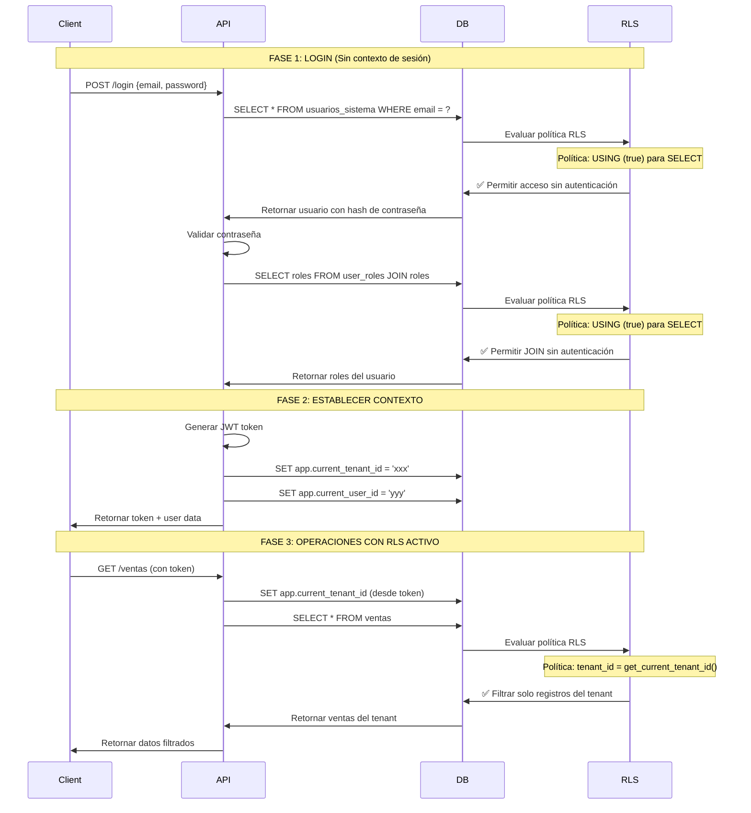

# Design Document - Reactivación de RLS (Row Level Security)

## Overview

Este documento describe el diseño técnico para reactivar el Row Level Security (RLS) en todas las tablas de la base de datos del sistema ERP multi-tenant. La solución garantiza el aislamiento de datos entre tenants mientras mantiene la funcionalidad del sistema, especialmente el proceso de autenticación.

### Objetivos del Diseño

1. **Seguridad**: Garantizar aislamiento completo de datos entre tenants
2. **Compatibilidad**: Mantener el proceso de login funcionando sin problemas
3. **Rendimiento**: Minimizar el impacto en el rendimiento de las consultas
4. **Mantenibilidad**: Crear políticas consistentes y fáciles de entender
5. **Idempotencia**: Permitir que la migración se ejecute múltiples veces sin errores

### Contexto Técnico

- **Base de datos**: PostgreSQL con Supabase
- **Funciones de contexto existentes**: 
  - `get_current_tenant_id()`: Retorna el tenant_id del contexto o el default
  - `get_current_user_id()`: Retorna el user_id del contexto o desde auth.uid()
- **Tenant por defecto**: `550e8400-e29b-41d4-a716-446655440000`
- **Problema actual**: RLS desactivado en tablas críticas debido a problemas con el login

## Architecture

### Estrategia de Políticas RLS

El diseño implementa una estrategia de políticas RLS basada en tres niveles:

```
┌─────────────────────────────────────────────────────────────┐
│                    NIVEL 1: AUTENTICACIÓN                    │
│  Tablas que requieren acceso sin autenticación para login    │
│  - usuarios_sistema (SELECT sin auth)                        │
│  - user_roles (SELECT sin auth)                              │
│  - roles (SELECT sin auth)                                   │
└─────────────────────────────────────────────────────────────┘
                              │
                              ▼
┌─────────────────────────────────────────────────────────────┐
│              NIVEL 2: AISLAMIENTO POR TENANT                 │
│  Tablas con tenant_id que requieren filtrado automático      │
│  - Módulos de negocio (ventas, compras, contabilidad, etc.) │
│  - Datos maestros (clientes, productos, empleados)          │
│  - Configuración (empresa_config, fe_configuracion)         │
└─────────────────────────────────────────────────────────────┘
                              │
                              ▼
┌─────────────────────────────────────────────────────────────┐
│              NIVEL 3: TABLAS SIN TENANT_ID                   │
│  Tablas globales o de catálogo                               │
│  - Catálogos (paises, tipos_impuestos)                      │
│  - Tablas de relación (rol_permisos)                        │
│  - Tablas de sistema (outbox_events)                        │
└─────────────────────────────────────────────────────────────┘
```

### Flujo de Autenticación con RLS



## Components and Interfaces

### 1. Políticas RLS por Categoría de Tabla

#### 1.1 Tablas de Autenticación (Nivel 1)

**Tablas afectadas**: `usuarios_sistema`, `user_roles`, `roles`

**Estrategia**: Permitir SELECT sin autenticación para el proceso de login, pero requerir autenticación para modificaciones.

```sql
-- Política para SELECT (necesaria para login)
CREATE POLICY "{tabla}_allow_login_select" ON public.{tabla}
    FOR SELECT
    USING (true);

-- Política para INSERT/UPDATE/DELETE (requiere autenticación y tenant)
CREATE POLICY "{tabla}_authenticated_write" ON public.{tabla}
    FOR ALL
    USING (
        get_current_user_id() IS NOT NULL
        AND (
            -- Super admins tienen acceso total
            EXISTS (
                SELECT 1 FROM public.usuarios_sistema
                WHERE id = get_current_user_id()
                AND is_super_admin = true
            )
            OR
            -- Usuarios normales solo su tenant
            tenant_id = get_current_tenant_id()
        )
    );
```

**Justificación**: El proceso de login requiere consultar usuarios_sistema antes de establecer el contexto de sesión. Sin esta política, el login fallaría con un error de RLS.

#### 1.2 Tablas con tenant_id (Nivel 2)

**Tablas afectadas**: 
- Módulos de negocio: `ventas`, `cotizaciones`, `documentos`, `ordenes_compra`, `asientos_contables`, `planillas`, etc.
- Datos maestros: `clientes`, `productos`, `empleados`, `proveedores`
- Configuración: `empresa_config`, `fe_configuracion`, `documento_series`
- Auditoría: `audit_log`, `documento_auditoria`

**Estrategia**: Filtrado automático por tenant_id con excepción para super admins.

```sql
CREATE POLICY "{tabla}_tenant_isolation" ON public.{tabla}
    FOR ALL
    USING (
        -- Super admins pueden ver todos los tenants
        EXISTS (
            SELECT 1 FROM public.usuarios_sistema
            WHERE id = get_current_user_id()
            AND is_super_admin = true
        )
        OR
        -- Usuarios normales solo ven su tenant
        tenant_id = get_current_tenant_id()
    );
```

**Optimización**: Para tablas de alto tráfico, se crearán índices compuestos:

```sql
CREATE INDEX idx_{tabla}_tenant_id ON public.{tabla}(tenant_id);
CREATE INDEX idx_{tabla}_tenant_created ON public.{tabla}(tenant_id, created_at DESC);
```

#### 1.3 Tablas de Relación sin tenant_id directo (Nivel 3)

**Tablas afectadas**: `rol_permisos`, `user_roles` (para escritura)

**Estrategia**: Validar a través de las tablas relacionadas.

```sql
-- Ejemplo: rol_permisos
CREATE POLICY "rol_permisos_tenant_isolation" ON public.rol_permisos
    FOR ALL
    USING (
        -- Super admins tienen acceso total
        EXISTS (
            SELECT 1 FROM public.usuarios_sistema
            WHERE id = get_current_user_id()
            AND is_super_admin = true
        )
        OR
        -- Validar que el rol pertenezca al tenant del usuario
        EXISTS (
            SELECT 1 FROM public.roles r
            WHERE r.id = rol_permisos.role_id
            AND r.tenant_id = get_current_tenant_id()
        )
    );
```

#### 1.4 Tablas de Catálogo Global (Nivel 3)

**Tablas afectadas**: `paises`, `tipos_impuestos`, `tipos_documentos_fiscales`, `configuracion_fiscal`

**Estrategia**: Lectura pública para usuarios autenticados, escritura solo para super admins.

```sql
CREATE POLICY "{tabla}_read_authenticated" ON public.{tabla}
    FOR SELECT
    USING (get_current_user_id() IS NOT NULL);

CREATE POLICY "{tabla}_write_super_admin" ON public.{tabla}
    FOR ALL
    USING (
        EXISTS (
            SELECT 1 FROM public.usuarios_sistema
            WHERE id = get_current_user_id()
            AND is_super_admin = true
        )
    );
```

#### 1.5 Tablas de Sistema (Nivel 3)

**Tablas afectadas**: `outbox_events`, `event_processing_log`, `user_sessions`

**Estrategia**: Acceso basado en propiedad o super admin.

```sql
-- Ejemplo: user_sessions
CREATE POLICY "user_sessions_own_access" ON public.user_sessions
    FOR ALL
    USING (
        -- Super admins pueden ver todas las sesiones
        EXISTS (
            SELECT 1 FROM public.usuarios_sistema
            WHERE id = get_current_user_id()
            AND is_super_admin = true
        )
        OR
        -- Usuarios solo ven sus propias sesiones
        usuario_sistema_id = get_current_user_id()
    );
```

### 2. Inventario Completo de Tablas

#### Tablas con tenant_id (Requieren política de aislamiento)

| Categoría | Tablas |
|-----------|--------|
| **Autenticación** | usuarios_sistema, roles |
| **Configuración** | empresa_config, fe_configuracion, documento_series, usuario_configuracion |
| **Ventas** | clientes, cotizaciones, cotizacion_detalles, ventas, venta_detalles, pagos_ventas |
| **Documentos** | documentos, documento_detalles, documento_archivos, documento_auditoria |
| **Compras** | proveedores, ordenes_compra, orden_compra_detalles |
| **Inventario** | productos, movimientos_stock, categorias_productos |
| **Contabilidad** | plan_cuentas, asientos_contables, detalle_asientos, cuentas_por_cobrar, cuentas_por_pagar, gastos, pagos_facturas |
| **RRHH** | empleados, contratos, asistencias, planillas, planilla_detalles, historial_pagos_planilla, rrhh_pagos, asientos_contables_rrhh |
| **Seguridad** | permisos, audit_log, user_sessions |
| **Sistema** | movimientos_stock |

#### Tablas sin tenant_id (Requieren políticas especiales)

| Categoría | Tablas | Estrategia RLS |
|-----------|--------|----------------|
| **Relaciones** | user_roles, rol_permisos | Validar a través de tablas relacionadas |
| **Catálogos** | paises, tipos_impuestos, tipos_documentos_fiscales, configuracion_fiscal | Lectura pública, escritura super admin |
| **Detalles** | cotizacion_detalles, venta_detalles, documento_detalles, orden_compra_detalles, planilla_detalles, detalle_asientos | Validar a través de tabla padre |
| **Sistema** | outbox_events, event_processing_log | Acceso basado en propiedad |
| **Agregados** | ventas_mensuales_agregadas, gastos_mensuales_agregados, utilidad_mensual_agregada, cuentas_cobrar_agregadas, cuentas_pagar_agregadas | Lectura autenticada, escritura sistema |
| **Auditoría** | auditoria_cotizaciones | Validar a través de tabla padre |
| **Finanzas** | cuentas_bancarias, movimientos_bancarios, cobranzas, tipos_cambio | Requiere tenant_id o validación especial |

## Data Models

### Modelo de Contexto de Sesión

```typescript
interface SessionContext {
  tenant_id: UUID;        // Establecido al hacer login
  user_id: UUID;          // Establecido al hacer login
  is_super_admin: boolean; // Determinado desde usuarios_sistema
}
```

### Modelo de Política RLS

```typescript
interface RLSPolicy {
  table_name: string;
  policy_name: string;
  policy_type: 'SELECT' | 'INSERT' | 'UPDATE' | 'DELETE' | 'ALL';
  using_clause: string;   // Condición USING
  with_check?: string;    // Condición WITH CHECK (opcional)
}
```

## Error Handling

### Escenarios de Error y Soluciones

#### 1. Error: Login bloqueado por RLS

**Síntoma**: `new row violates row-level security policy` al intentar hacer login

**Causa**: Política RLS en usuarios_sistema no permite SELECT sin autenticación

**Solución**: Política `USING (true)` para SELECT en usuarios_sistema

#### 2. Error: JOIN bloqueado en consulta de roles

**Síntoma**: No se pueden cargar roles del usuario durante login

**Causa**: RLS bloqueando el JOIN entre user_roles y roles

**Solución**: Políticas `USING (true)` para SELECT en user_roles y roles

#### 3. Error: Recursión infinita en política RLS

**Síntoma**: `infinite recursion detected in policy for relation`

**Causa**: Política RLS consulta usuarios_sistema para verificar is_super_admin, creando recursión

**Solución**: 
- Para usuarios_sistema: No verificar is_super_admin en la política de escritura
- Usar `SECURITY DEFINER` en funciones auxiliares si es necesario

#### 4. Error: Contexto de tenant no establecido

**Síntoma**: Consultas retornan datos del tenant por defecto en lugar del tenant del usuario

**Causa**: Backend no está estableciendo `app.current_tenant_id` después del login

**Solución**: 
- Verificar que el backend llame a `SET app.current_tenant_id` después de validar credenciales
- Implementar middleware que establezca el contexto en cada request

#### 5. Error: Performance degradado

**Síntoma**: Consultas lentas después de activar RLS

**Causa**: Falta de índices en columnas tenant_id

**Solución**: Crear índices compuestos en (tenant_id, created_at) para tablas de alto tráfico

### Estrategia de Rollback

Si la activación de RLS causa problemas críticos:

```sql
-- Desactivar RLS en tabla específica
ALTER TABLE public.{tabla} DISABLE ROW LEVEL SECURITY;

-- Eliminar política específica
DROP POLICY IF EXISTS "{policy_name}" ON public.{tabla};
```

## Testing Strategy

### 1. Tests de Autenticación

```sql
-- Test 1: Login sin contexto de sesión
-- Debe funcionar correctamente
SELECT * FROM usuarios_sistema WHERE email = 'test@example.com';

-- Test 2: Cargar roles durante login
-- Debe retornar roles sin error
SELECT r.* 
FROM user_roles ur
JOIN roles r ON r.id = ur.role_id
WHERE ur.usuario_sistema_id = 'xxx';
```

### 2. Tests de Aislamiento por Tenant

```sql
-- Test 3: Establecer contexto de tenant
SELECT set_config('app.current_tenant_id', 'tenant-1-uuid', false);
SELECT set_config('app.current_user_id', 'user-1-uuid', false);

-- Test 4: Verificar filtrado automático
-- Debe retornar solo registros de tenant-1
SELECT * FROM ventas;

-- Test 5: Cambiar a otro tenant
SELECT set_config('app.current_tenant_id', 'tenant-2-uuid', false);

-- Test 6: Verificar nuevo filtrado
-- Debe retornar solo registros de tenant-2
SELECT * FROM ventas;
```

### 3. Tests de Super Admin

```sql
-- Test 7: Login como super admin
SELECT set_config('app.current_user_id', 'super-admin-uuid', false);

-- Test 8: Verificar acceso a todos los tenants
-- Debe retornar registros de todos los tenants
SELECT tenant_id, COUNT(*) FROM ventas GROUP BY tenant_id;
```

### 4. Tests de Escritura

```sql
-- Test 9: Insertar registro en tenant actual
INSERT INTO ventas (tenant_id, ...) VALUES (get_current_tenant_id(), ...);
-- Debe funcionar

-- Test 10: Intentar insertar en otro tenant
INSERT INTO ventas (tenant_id, ...) VALUES ('otro-tenant-uuid', ...);
-- Debe fallar con error RLS
```

### 5. Tests de Performance

```sql
-- Test 11: Verificar uso de índices
EXPLAIN ANALYZE SELECT * FROM ventas WHERE tenant_id = get_current_tenant_id();
-- Debe usar índice idx_ventas_tenant_id

-- Test 12: Verificar performance de JOINs
EXPLAIN ANALYZE 
SELECT v.*, c.razon_social 
FROM ventas v 
JOIN clientes c ON c.id = v.cliente_id;
-- Debe usar índices en ambas tablas
```

### 6. Tests de Casos Especiales

```sql
-- Test 13: Acceso a catálogos globales
SELECT * FROM paises;
-- Debe funcionar para usuarios autenticados

-- Test 14: Modificar catálogo como usuario normal
UPDATE paises SET nombre = 'Test';
-- Debe fallar (solo super admin)

-- Test 15: Modificar catálogo como super admin
-- Debe funcionar
```

## Implementation Plan

### Fase 1: Preparación (Pre-migración)

1. Backup de la base de datos
2. Verificar que las funciones `get_current_tenant_id()` y `get_current_user_id()` existen
3. Verificar que todos los registros tienen tenant_id válido
4. Crear índices en columnas tenant_id

### Fase 2: Activación de RLS

1. Activar RLS en tablas de autenticación (usuarios_sistema, user_roles, roles)
2. Crear políticas para permitir login
3. Probar proceso de login
4. Activar RLS en tablas con tenant_id (por módulo)
5. Activar RLS en tablas sin tenant_id (catálogos, sistema)

### Fase 3: Validación

1. Ejecutar suite de tests
2. Verificar logs de errores
3. Monitorear performance
4. Validar con usuarios de prueba

### Fase 4: Documentación

1. Documentar políticas creadas
2. Documentar excepciones y casos especiales
3. Crear guía de troubleshooting

## Security Considerations

### 1. Prevención de Bypass de RLS

- **Nunca usar `SECURITY DEFINER`** en funciones que retornen datos sin validar tenant_id
- **Validar tenant_id en el backend** antes de establecer el contexto
- **No confiar solo en RLS** para seguridad crítica; validar también en capa de aplicación

### 2. Protección contra Inyección SQL

- Las funciones `get_current_tenant_id()` y `get_current_user_id()` usan `current_setting()` que es seguro
- No construir políticas RLS dinámicamente con concatenación de strings

### 3. Auditoría de Accesos

- Mantener `audit_log` con RLS para registrar accesos
- Super admins deben tener sus accesos auditados
- Implementar alertas para accesos sospechosos

### 4. Gestión de Super Admins

- Limitar número de super admins
- Auditar todas las acciones de super admins
- Implementar MFA para super admins
- Revisar periódicamente lista de super admins

## Performance Optimization

### 1. Índices Recomendados

```sql
-- Índices para tablas de alto tráfico
CREATE INDEX idx_ventas_tenant_created ON ventas(tenant_id, created_at DESC);
CREATE INDEX idx_documentos_tenant_serie ON documentos(tenant_id, serie, numero);
CREATE INDEX idx_clientes_tenant_activo ON clientes(tenant_id) WHERE activo = true;
CREATE INDEX idx_productos_tenant_activo ON productos(tenant_id) WHERE activo = true;
```

### 2. Optimización de Políticas

- Usar `EXISTS` en lugar de `IN` para subqueries
- Evitar funciones complejas en políticas RLS
- Cachear resultados de `is_super_admin` en el contexto de sesión si es posible

### 3. Monitoreo

- Monitorear `pg_stat_statements` para identificar queries lentas
- Revisar planes de ejecución de queries críticas
- Establecer alertas para queries que no usen índices

## Migration Strategy

### Orden de Ejecución

1. **Verificar prerequisitos**: Funciones, índices, datos
2. **Tablas de autenticación**: usuarios_sistema, user_roles, roles
3. **Tablas de configuración**: empresa_config, fe_configuracion
4. **Tablas de datos maestros**: clientes, productos, empleados
5. **Tablas de módulos**: ventas, compras, contabilidad, RRHH, documentos
6. **Tablas de sistema**: audit_log, user_sessions, outbox_events
7. **Tablas de catálogo**: paises, tipos_impuestos, etc.
8. **Validación final**: Tests y verificación

### Rollback Plan

Si algo falla durante la migración:

1. Desactivar RLS en todas las tablas afectadas
2. Eliminar políticas creadas
3. Restaurar desde backup si es necesario
4. Analizar logs de error
5. Corregir problema
6. Reintentar migración

## Maintenance and Monitoring

### Tareas de Mantenimiento

1. **Semanal**: Revisar logs de errores RLS
2. **Mensual**: Auditar accesos de super admins
3. **Trimestral**: Revisar y optimizar políticas RLS
4. **Anual**: Revisar lista de super admins y permisos

### Métricas a Monitorear

- Tiempo de respuesta de queries con RLS
- Número de errores RLS por día
- Uso de índices en queries con tenant_id
- Número de accesos de super admins

### Alertas Recomendadas

- Error RLS en proceso de login
- Query lenta (>1s) con RLS
- Acceso de super admin fuera de horario laboral
- Intento de acceso a tenant no autorizado
