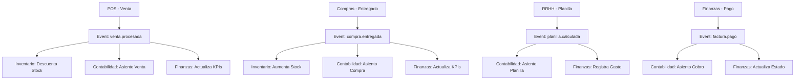

# Integraciones ERP - Sistema Cohesionado ✅

## Resumen de Integraciones Implementadas

El sistema ERP ahora cuenta con integraciones completas entre todos los módulos principales, eliminando las operaciones en silos y creando un flujo de información automático y coherente.

## 🎯 Integraciones Implementadas

### 1. **Ventas ↔ Inventario** ✅
- **Integración**: Cuando se procesa una venta en POS, automáticamente se descuenta el stock
- **Evento**: `venta.procesada` → `InventoryIntegrationService`
- **Flujo**: POS emite evento → Inventario actualiza stock → Registra movimiento
- **Resultado**: Stock siempre actualizado tras cada venta

### 2. **Ventas ↔ Contabilidad** ✅
- **Integración**: Cada venta genera asientos contables automáticos
- **Evento**: `venta.procesada` → `AccountingIntegrationService`
- **Asientos generados**:
  - DEBE: Caja/Bancos (total venta)
  - HABER: Ventas (subtotal)
  - HABER: IGV por Pagar (impuestos)
  - DEBE: Costo de Ventas
  - HABER: Inventario (costo)
- **Resultado**: Libros contables actualizados automáticamente

### 3. **Compras ↔ Inventario** ✅
- **Integración**: Al marcar orden como "ENTREGADO", aumenta stock automáticamente
- **Evento**: `compra.entregada` → `InventoryIntegrationService`
- **Flujo**: Compras cambia estado → Inventario aumenta stock → Registra entrada
- **Resultado**: Inventario reflejado inmediatamente tras recepciones

### 4. **Compras ↔ Contabilidad** ✅
- **Integración**: Compras entregadas generan asientos contables automáticos
- **Evento**: `compra.entregada` → `AccountingIntegrationService`
- **Asientos generados**:
  - DEBE: Inventario (aumento activo)
  - HABER: Cuentas por Pagar o Efectivo
- **Resultado**: Contabilidad refleja compras sin intervención manual

### 5. **RRHH (Planillas) ↔ Contabilidad** ✅ **NUEVA**
- **Integración**: Planillas calculadas y pagadas generan asientos automáticos
- **Eventos**: 
  - `planilla.calculada` → Asientos de provisión
  - `planilla.pagada` → Asientos de pago
- **Asientos de Planilla**:
  - DEBE: Remuneraciones (621)
  - DEBE: Seguridad Social (627)
  - HABER: Remuneraciones por Pagar (411)
  - HABER: Tributos por Pagar (403)
  - HABER: ESSALUD por Pagar (407)
- **Asientos de Pago**:
  - DEBE: Remuneraciones por Pagar
  - HABER: Caja/Bancos
- **Resultado**: Ciclo completo de nómina contabilizado automáticamente

### 6. **Finanzas ↔ Contabilidad/Ventas** ✅ **NUEVA**
- **Integración**: Pagos de facturas y gastos generan asientos automáticos
- **Eventos**:
  - `factura.pago` → Asientos de cobro
  - `gasto.registrado` → Asientos de gasto
- **Asientos de Cobro**:
  - DEBE: Caja/Bancos
  - HABER: Cuentas por Cobrar
- **Asientos de Gasto**:
  - DEBE: Cuenta de Gasto correspondiente
  - HABER: Caja/Bancos/Proveedores
- **Resultado**: Estado financiero siempre actualizado

### 7. **Finanzas ↔ Todos los Módulos** ✅ **MEJORADA**
- **Integración**: KPIs financieros se actualizan con eventos de todos los módulos
- **Eventos escuchados**: Ventas, Compras, Planillas, Pagos, Gastos, Movimientos
- **KPIs calculados**:
  - Efectivo disponible
  - Cuentas por cobrar/pagar
  - Utilidad y margen bruto
  - Rotación de inventario
  - Alertas financieras
- **Resultado**: Dashboard financiero en tiempo real

## 🔄 Flujo de Eventos Implementado



## 🚀 Nuevos Endpoints Implementados

### Finanzas Controller
- `POST /api/finanzas/facturas/:id/pagar` - Registrar pago de factura
- `POST /api/finanzas/gastos` - Registrar nuevo gasto
- `GET /api/finanzas/kpis` - Obtener KPIs financieros
- `GET /api/finanzas/cuentas-por-cobrar` - Ver cuentas por cobrar
- `GET /api/finanzas/alertas` - Obtener alertas financieras
- `GET /api/finanzas/flujo-efectivo` - Análisis de flujo de efectivo

### Eventos Nuevos
- `planilla.calculada` - Cuando se calcula una planilla
- `planilla.pagada` - Cuando se paga una planilla
- `factura.pago` - Cuando se registra pago de factura
- `gasto.registrado` - Cuando se registra un gasto

## 📊 Beneficios Logrados

### ✅ **Eliminación de Silos**
- Ya no hay módulos operando independientemente
- Información fluye automáticamente entre áreas
- Datos consistentes en todo el sistema

### ✅ **Automatización Contable**
- Asientos contables generados automáticamente
- Cumplimiento normativo automático (Plan Contable General Empresarial)
- Eliminación de errores de transcripción manual

### ✅ **Control Financiero en Tiempo Real**
- KPIs actualizados automáticamente
- Alertas proactivas de situaciones críticas
- Visibilidad completa del estado financiero

### ✅ **Trazabilidad Completa**
- Cada transacción genera registros en múltiples módulos
- Auditabilidad mejorada
- Reconciliación automática entre módulos

### ✅ **Eficiencia Operacional**
- Reducción de trabajo manual
- Menor tiempo de cierre contable
- Reportes financieros inmediatos

## 🔧 Configuración de Eventos

Todos los servicios de integración se inicializan automáticamente y escuchan eventos relevantes:

```typescript
// EventBusService registra listeners automáticamente
AccountingIntegrationService  // Escucha: ventas, compras, planillas, pagos, gastos
InventoryIntegrationService   // Escucha: ventas, compras
FinancialIntegrationService   // Escucha: ventas, compras, planillas, pagos, gastos
DashboardIntegrationService   // Escucha: todos los eventos para métricas
```

## 🎯 Resultado Final

El sistema ERP ahora opera como una **unidad cohesionada** donde:

1. **Ventas** automáticamente afectan inventario y contabilidad
2. **Compras** automáticamente afectan inventario y contabilidad  
3. **Planillas** automáticamente generan asientos contables y afectan finanzas
4. **Pagos** automáticamente se reflejan en contabilidad y estado financiero
5. **Gastos** automáticamente generan asientos y afectan KPIs
6. **Todos los módulos** mantienen la información sincronizada en tiempo real

La implementación elimina la necesidad de:
- ❌ Actualización manual de stock tras ventas
- ❌ Ingreso manual de asientos contables
- ❌ Sincronización manual entre módulos
- ❌ Cálculo manual de KPIs financieros
- ❌ Reconciliación manual de datos

El ERP ahora funciona como un **sistema integrado verdadero** que proporciona:
- ✅ **Automatización completa** del flujo de información
- ✅ **Consistencia** de datos en tiempo real
- ✅ **Eficiencia operacional** mejorada
- ✅ **Control financiero** robusto
- ✅ **Cumplimiento normativo** automático 