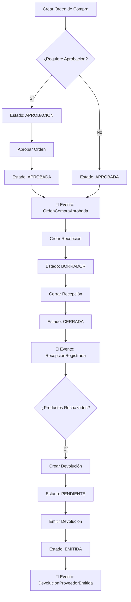

# Implementación: Eventos de Dominio - Módulo Compras

## Resumen

Se han implementado y verificado los tres eventos de dominio principales del módulo de compras, asegurando que se emitan correctamente en los momentos clave del flujo de negocio.

## Eventos Implementados

### 1. OrdenCompraAprobada ✅

**Cuándo se emite:** Cuando una orden de compra alcanza el estado `APROBADA` después de completar todas las aprobaciones requeridas.

**Ubicación:** `apps/erp-api/src/modules/compras/services/ordenes-compra.service.ts`

**Método emisor:** `emitirEventoOrdenAprobada()`

**Payload del evento:**
```typescript
{
  ordenId: string;
  numeroOrden: string;
  proveedorId: string;
  proveedorNombre: string;
  total: number;
  subtotal: number;
  igv: number;
  moneda: string;
  fechaOrden: string;
  fechaEntregaEsperada?: string;
  aprobadoPor: string;
  aprobadoEn: string;
  diasCredito?: number;
  items: Array<{
    productoId: string;
    descripcion: string;
    cantidad: number;
    precioUnitario: number;
    total: number;
  }>;
  tenantId: string;
}
```

**Consumidores potenciales:**
- Módulo de Finanzas (CxP): Crear cuenta por pagar si está configurado
- Módulo de Inventario: Preparar recepción esperada
- Módulo de Contabilidad: Crear asiento de compromiso
- Módulo de Notificaciones: Notificar al área de almacén

---

### 2. RecepcionRegistrada ✅

**Cuándo se emite:** Cuando se cierra una recepción de mercancía (estado cambia de `BORRADOR` a `CERRADA`).

**Ubicación:** `apps/erp-api/src/modules/compras/services/recepciones.service.ts`

**Método emisor:** `emitirEventoRecepcionRegistrada()`

**Payload del evento:**
```typescript
{
  recepcionId: string;
  numeroRecepcion: string;
  ordenId: string;
  numeroOrden: string;
  proveedorId: string;
  proveedorNombre: string;
  proveedorRuc: string;
  almacenId: string;
  fechaRecepcion: string;
  subtotal: number;
  igv: number;
  total: number;
  moneda: string;
  diasCredito?: number;
  condicionesPago?: string;
  items: Array<{
    productoId: string;
    descripcion: string;
    cantidadRecibida: number;
    precioUnitario: number;
    total: number;
    calidad: string;
    lote?: string;
    serie?: string;
    ubicacionId?: string;
  }>;
  tenantId: string;
}
```

**Consumidores potenciales:**
- Módulo de Finanzas (CxP): Crear cuenta por pagar automáticamente
- Módulo de Inventario: Ya actualizado durante el cierre
- Módulo de Contabilidad: Registrar asiento contable de compra
- Módulo de Notificaciones: Notificar a finanzas sobre nueva CxP

**Integración actual:**
- ✅ `ComprasCxpIntegrationService` escucha este evento y crea CxP automáticamente

---

### 3. DevolucionProveedorEmitida ✅

**Cuándo se emite:** Cuando se emite una devolución a proveedor (estado cambia de `PENDIENTE` a `EMITIDA`).

**Ubicación:** `apps/erp-api/src/modules/compras/services/devoluciones-proveedor.service.ts`

**Método emisor:** `emitirEventoDevolucionEmitida()`

**Payload del evento:**
```typescript
{
  devolucionId: string;
  numeroDevolucion: string;
  ordenId: string;
  numeroOrden?: string;
  recepcionId?: string;
  numeroRecepcion?: string;
  proveedorId: string;
  proveedorNombre: string;
  fechaDevolucion: string;
  motivo: string;
  subtotal: number;
  igv: number;
  total: number;
  moneda: string;
  items: Array<{
    productoId: string;
    descripcion: string;
    cantidad: number;
    precioUnitario: number;
    subtotal: number;
    motivoDetalle?: string;
    lote?: string;
    serie?: string;
  }>;
  emitidoPor?: string;
  emitidoEn: string;
  tenantId: string;
}
```

**Consumidores potenciales:**
- Módulo de Finanzas (CxP): Crear nota de crédito de proveedor (CxP negativo)
- Módulo de Inventario: Ya actualizado durante la emisión
- Módulo de Contabilidad: Registrar asiento de devolución
- Módulo de Notificaciones: Notificar al proveedor sobre la devolución

---

## Cambios Realizados

### 1. EventBusService (`apps/erp-api/src/shared/events/event-bus.service.ts`)

#### Interfaz agregada:
```typescript
export interface DevolucionProveedorEmitidaEvent {
  devolucionId: string;
  numeroDevolucion: string;
  ordenId: string;
  numeroOrden?: string;
  recepcionId?: string;
  numeroRecepcion?: string;
  proveedorId: string;
  proveedorNombre: string;
  fechaDevolucion: string;
  motivo: string;
  subtotal: number;
  igv: number;
  total: number;
  moneda: string;
  items: Array<{
    productoId: string;
    descripcion: string;
    cantidad: number;
    precioUnitario: number;
    subtotal: number;
    motivoDetalle?: string;
    lote?: string;
    serie?: string;
  }>;
  emitidoPor?: string;
  emitidoEn: string;
  tenantId: string;
}
```

#### Métodos agregados:
```typescript
// Emisor
emitDevolucionProveedorEmitida(data: DevolucionProveedorEmitidaEvent): void

// Listener
onDevolucionProveedorEmitida(listener: (event: ERPEvent) => void): void
```

### 2. DevolucionesProveedorService

#### Método agregado:
```typescript
private async emitirEventoDevolucionEmitida(
  devolucion: any,
  tenantId: string,
  userId?: string
): Promise<void>
```

Este método:
1. Obtiene información completa del proveedor, orden y recepción
2. Construye el payload completo del evento
3. Emite el evento usando el método tipado `emitDevolucionProveedorEmitida()`
4. Maneja errores sin bloquear la operación principal

#### Actualización en `emitirDevolucion()`:
- Reemplazado el uso de `eventBus.emit()` genérico por llamada al método privado `emitirEventoDevolucionEmitida()`
- Mejora la consistencia con los otros servicios (OrdenesCompraService y RecepcionesService)

---

## Flujo de Eventos en el Módulo de Compras



---

## Verificación

### Script de Prueba

Se ha creado el script `test-eventos-dominio.ps1` que:

1. **Parte 1:** Crea y aprueba una orden de compra
   - Verifica emisión de `OrdenCompraAprobada`

2. **Parte 2:** Crea y cierra una recepción
   - Verifica emisión de `RecepcionRegistrada`

3. **Parte 3:** Crea y emite una devolución
   - Verifica emisión de `DevolucionProveedorEmitida`

### Ejecución del Test

```powershell
.\test-eventos-dominio.ps1
```

### Logs Esperados

En los logs del servidor, deberías ver:

```
🎯 [EventBus] Emitiendo evento: orden.compra.aprobada desde compras
✅ Evento OrdenCompraAprobada emitido para orden OC-XXX

📡 [Recepciones] Emitiendo evento RecepcionRegistrada para [uuid]
✅ Evento RecepcionRegistrada emitido exitosamente

📡 [Devoluciones] Emitiendo evento DevolucionProveedorEmitida para DEV-XXX
✅ Evento DevolucionProveedorEmitida emitido exitosamente para DEV-XXX
```

---

## Integración con Otros Módulos

### Módulo de Finanzas (CxP)

**Listener actual:**
```typescript
// En ComprasCxpIntegrationService
eventBusService.onRecepcionRegistrada(async (event: ERPEvent) => {
  const data = event.data as RecepcionRegistradaEvent;
  // Crear cuenta por pagar automáticamente
});
```

**Listeners pendientes:**
```typescript
// Crear CxP en aprobación de OC (si está configurado)
eventBusService.onOrdenCompraAprobada(async (event: ERPEvent) => {
  const data = event.data as OrdenCompraAprobadaEvent;
  // Verificar configuración y crear CxP si aplica
});

// Crear nota de crédito por devolución
eventBusService.onDevolucionProveedorEmitida(async (event: ERPEvent) => {
  const data = event.data as DevolucionProveedorEmitidaEvent;
  // Crear nota de crédito (CxP negativo)
});
```

### Módulo de Contabilidad

**Listeners sugeridos:**
```typescript
// Asiento de compromiso al aprobar OC
eventBusService.onOrdenCompraAprobada(async (event: ERPEvent) => {
  // Crear asiento contable de compromiso
});

// Asiento de compra al recibir mercancía
eventBusService.onRecepcionRegistrada(async (event: ERPEvent) => {
  // Crear asiento contable de compra
});

// Asiento de devolución
eventBusService.onDevolucionProveedorEmitida(async (event: ERPEvent) => {
  // Crear asiento contable de devolución
});
```

### Módulo de Notificaciones

**Listeners sugeridos:**
```typescript
// Notificar a almacén sobre OC aprobada
eventBusService.onOrdenCompraAprobada(async (event: ERPEvent) => {
  // Notificar al área de almacén para preparar recepción
});

// Notificar a finanzas sobre nueva CxP
eventBusService.onRecepcionRegistrada(async (event: ERPEvent) => {
  // Notificar a finanzas sobre cuenta por pagar creada
});

// Notificar a proveedor sobre devolución
eventBusService.onDevolucionProveedorEmitida(async (event: ERPEvent) => {
  // Enviar notificación/email al proveedor
});
```

---

## Estado de Implementación

| Evento | Interfaz | Emisor | Listener | Integración |
|--------|----------|--------|----------|-------------|
| OrdenCompraAprobada | ✅ | ✅ | ✅ | ⏳ Pendiente |
| RecepcionRegistrada | ✅ | ✅ | ✅ | ✅ CxP Integration |
| DevolucionProveedorEmitida | ✅ | ✅ | ✅ | ⏳ Pendiente |

**Leyenda:**
- ✅ Implementado
- ⏳ Pendiente de implementación
- ❌ No implementado

---

## Próximos Pasos

1. **Implementar listeners en módulo de Finanzas:**
   - Listener para `OrdenCompraAprobada` (crear CxP si está configurado)
   - Listener para `DevolucionProveedorEmitida` (crear nota de crédito)

2. **Implementar listeners en módulo de Contabilidad:**
   - Asientos contables automáticos para los tres eventos

3. **Implementar listeners en módulo de Notificaciones:**
   - Notificaciones automáticas a usuarios relevantes
   - Emails a proveedores

4. **Implementar Outbox Pattern:**
   - Persistir eventos en tabla `outbox_events` antes de emitir
   - Garantizar entrega de eventos incluso si el sistema falla

5. **Monitoreo y Observabilidad:**
   - Dashboard de eventos emitidos/procesados
   - Alertas para eventos fallidos
   - Métricas de latencia de procesamiento

---

## Referencias

- **Especificación:** `.kiro/specs/tasks/fase-2-compras-tasks.md` - Task 2.5, 2.6, 2.7
- **Event Bus:** `apps/erp-api/src/shared/events/event-bus.service.ts`
- **Servicios:**
  - `apps/erp-api/src/modules/compras/services/ordenes-compra.service.ts`
  - `apps/erp-api/src/modules/compras/services/recepciones.service.ts`
  - `apps/erp-api/src/modules/compras/services/devoluciones-proveedor.service.ts`
- **Integración CxP:** `apps/erp-api/src/modules/compras/services/compras-cxp-integration.service.ts`
- **Test Script:** `test-eventos-dominio.ps1`

---

## Conclusión

Los tres eventos de dominio principales del módulo de compras están completamente implementados y listos para ser consumidos por otros módulos del sistema. La arquitectura basada en eventos permite:

- **Desacoplamiento:** Los módulos no dependen directamente entre sí
- **Escalabilidad:** Fácil agregar nuevos consumidores de eventos
- **Auditabilidad:** Todos los eventos quedan registrados en logs
- **Flexibilidad:** Configuración de qué eventos procesar y cuándo

La implementación sigue las mejores prácticas de Domain-Driven Design (DDD) y Event-Driven Architecture (EDA).
