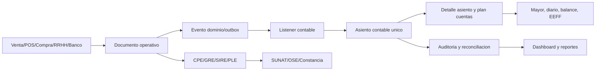

# Auditoria Forense Contable ERP - Peru

Fecha de ejecucion: 2026-05-22
Zona horaria de trabajo: America/Lima
Alcance inicial solicitado: auditoria forense contable, tributaria y de flujo.
Alcance posterior solicitado: remediar los hallazgos bloqueantes y dejar el flujo listo para produccion tecnica.
Archivo principal de evidencia: `docs/auditoria_forense_contable_2026-05.md`.

## 0. Cierre Post-Remediacion

Estado tecnico al cierre: apto para despliegue tecnico en el alcance validado por pruebas automatizadas y validaciones runtime. No reemplaza certificacion legal externa ni pruebas con credenciales SUNAT/OSE reales.

Cambios principales aplicados despues de la auditoria inicial:

- Trazabilidad contable CPE/CxC: `event_id` canonico propagado desde eventos fiscales hacia outbox y `source_event_id` de asientos para nuevos flujos.
- Contabilidad automatica: fortalecida la recepcion de eventos canonicos en `EventBusService` y listener contable.
- PLE: validacion de periodo/RUC, formato de fechas, importes, sanitizacion de campos y lineas con pipe final; consultas fallback acotadas por tenant y fecha.
- RRHH/planillas: conceptos base, UIT/RMV 2026, asignacion familiar 10% RMV, tasas base ONP/AFP/EsSalud y auto-seed de cuentas PCGE RRHH.
- Retenciones y defaults operativos: migracion `331__production_accounting_flow_hardening.sql` para retenciones CUARTA/QUINTA, conceptos planilla, cuentas RRHH, trigger de seed por tenant futuro y backfill de trazabilidad CPE.
- Cierre fiscal CxP/Tesoreria: migracion `332__accounting_production_compliance_closure.sql` con normativa Peru 2026 por periodo, columnas de retencion/percepcion/detraccion/anticipo en CxP, evidencia de bancarizacion y validador runtime.
- Bancarizacion: pagos CxP desde S/ 2,000 o US$ 500 rechazan efectivo y exigen cuenta bancaria + referencia bancaria; pagos por lote rechazan efectivo.
- RRHH: calculo de planillas resuelve UIT/RMV/AFP/ONP/EsSalud/quinta desde tabla normativa por periodo, con fallback 2026 y EsSalud en planilla personalizada.
- UI/API: alias `/api/usuarios`, filtros SIRE robustos contra carreras de carga, hidratacion API mas estable, CPE/SIRE sin desmontar la grilla durante carga.
- E2E: datos de prueba fiscalmente validos, aprobadores reales, CSV de conciliacion ajustado al contrato del backend y timeouts acordes a flujo SIRE completo.

Evidencia final de pruebas:

| Gate | Resultado final |
|---|---:|
| `pnpm --filter @erp-suite/erp-api run type-check` | OK |
| `pnpm --filter @erp-suite/web run type-check` | OK |
| `pnpm --filter @erp-suite/erp-api run test -- --runInBand` | OK, 104 suites / 951 tests |
| 9 E2E criticos solicitados | OK, 9/9 en 21.0m |
| `validar_retenciones_runtime` | OK, 8/8 checks |
| `validar_materialized_views_contabilidad` | OK, MVs existen y pobladas |
| `validar_contabilidad_asientos_estado_runtime` | OK, 17/17 checks |
| `validar_accounting_production_compliance_runtime` | OK, 5/5 checks |

Validacion adicional 2026-05-23 con certificado digital de prueba local:

- Archivo detectado: `certs/demo.pfx`.
- Resultado: el PFX se puede leer con la configuracion local sin exponer secretos.
- Vigencia observada: 2025-10-19 a 2027-10-19.
- Test focal ejecutado: `pnpm --filter @erp-suite/erp-api run test -- src/shared/crypto/xml-signer-runtime.spec.ts --runInBand`.
- Resultado: OK; `XmlSigner` carga el certificado desde el workspace y no cae en fallback demo.
- Alcance: valida lectura de certificado y capacidad tecnica de firma XML. No valida aceptacion legal SUNAT/OSE, CDR, ticket, acuse, ni envio SIRE/PLE/PLAME real.

Riesgos residuales no cerrados por codigo en esta remediacion:

- Envio SUNAT/OSE/SIRE real requiere credenciales, certificados, acuses y smoke productivo autorizado. Esto no es una falla de codigo: es una validacion operacional que solo puede hacerse con secretos reales del contribuyente o del OSE.
- La auditoria legal final debe validar regimenes especificos del contribuyente y codigos/tasas SPOT por giro real; el control tecnico de CxP/bancarizacion ya quedo aplicado para nuevos flujos.
- Antes de produccion real, el operador debe aplicar las migraciones `331` y `332` en el ambiente destino, cargar secretos, configurar el tenant y ejecutar un smoke fiscal externo.
- El arbol local sigue teniendo cambios previos del usuario no relacionados; no se hizo revert de nada ajeno.

### 0.1 Checklist Para Cargar Credenciales y Cerrar Produccion

Este checklist es para el usuario/operador que va a poner credenciales reales. No debe subirse ningun secreto al repositorio.

1. Preparar secretos del ambiente.
   - En el backend/API definir `CERT_ENCRYPTION_KEY` con minimo 32 caracteres. Si se va a usar un certificado global de respaldo, definir tambien `PFX_PATH` y `PFX_PASS`.
   - Si se emite por OSE, definir el endpoint y credenciales reales: `OSE_URL`, `OSE_USERNAME`, `OSE_PASSWORD` o los campos equivalentes del tenant (`oseApiKey`, `oseBearerToken`, `oseAuthTipo`).
   - Si se emite directo contra SUNAT, definir las credenciales reales o de homologacion segun corresponda: `SUNAT_ENVIRONMENT`, `SUNAT_USERNAME`, `SUNAT_PASSWORD`, `SUNAT_API_KEY`, `SUNAT_API_SECRET`.
   - Guardar estos valores en el gestor de secretos del despliegue, por ejemplo variables seguras de Vercel/Docker/Supabase/CI. Localmente usar `.env.local`; nunca commitear estos valores.

2. Configurar el tenant desde la aplicacion.
   - Entrar como administrador del tenant y completar el wizard/configuracion de empresa: RUC, razon social, direccion fiscal, ubigeo, regimen, moneda, series y modo de emision.
   - Cargar el certificado digital PFX/P12 y su password desde el flujo de configuracion. La API valida el payload en `POST /api/configuration/wizard/validate-certificate` y completa la configuracion en `POST /api/configuration/complete`.
   - Si el tenant usa OSE, guardar `emisionCpeModo=OSE_API`, `oseActivo=true`, `oseUrl` y el metodo de autenticacion real. Si no usa OSE, dejar `SUNAT_DIRECTO` y validar el certificado/credenciales SUNAT.

3. Verificar estado antes de emitir.
   - Consultar `GET /api/configuration/status`; debe quedar completo, con certificado existente y vigente.
   - Consultar `GET /api/configuration/empresa` y revisar RUC, series, modo de emision, OSE/SUNAT y fecha de vencimiento del certificado.
   - Ejecutar una firma XML sin envio y luego una emision de homologacion autorizada. Guardar CDR/ticket/acuse en evidencia operativa.

4. Hacer smoke fiscal externo.
   - Emitir CPE y GRE de prueba autorizados por SUNAT/OSE/homologacion.
   - Generar SIRE RVIE/RCE del periodo de prueba y validar ticket/acuse real si el servicio externo esta habilitado.
   - Exportar PLE del periodo de prueba y validarlo con el software/servicio oficial antes de usarlo como libro definitivo.
   - Confirmar que `integration_logs`, asientos, CxC/CxP, SIRE/PLE y dashboard contable reflejan la misma operacion.

5. Pasar a produccion.
   - Cambiar `SUNAT_ENVIRONMENT` o endpoint OSE a produccion solo despues del smoke exitoso.
   - Bloquear cambios de configuracion fiscal a roles autorizados.
   - Activar monitoreo de certificado por vencer, outbox no completado, CPE sin asiento, SIRE/PLE vs mayor y pagos sujetos a bancarizacion.

Lectura ejecutiva: tras esta remediacion, lo que falta para produccion no es "programar otra regla contable base"; falta que el contribuyente cargue secretos reales, complete configuracion fiscal, valide contra SUNAT/OSE/PLE/PLAME real y conserve acuses.

## 1. Resumen Ejecutivo

La auditoria inicial confirmo una base tecnica fuerte en integridad multi-tenant, RLS, idempotencia contable, constraints de asientos, validadores runtime por modulo y una suite API verde. Tambien detecto brechas criticas de trazabilidad CPE -> asiento, PLE, materialized views contables, semillas de retenciones por tenant y RRHH/planillas. La fase posterior de remediacion corrigio los bloqueantes tecnicos principales y dejo verdes los gates automatizados del flujo contable solicitado.

El repositorio se audito sobre un arbol local sucio y no pusheado, por instruccion del usuario. Para no mezclar cambios ajenos, la remediacion se preparo con staging selectivo de archivos contables/fiscales y documentacion de esta auditoria. `git status --short` al inicio de evidencia mostro cambios previos no relacionados; no se revirtio ningun cambio del usuario.

Resultado de pruebas al cierre post-remediacion:

| Gate | Resultado |
|---|---:|
| `pnpm --filter @erp-suite/erp-api run type-check` | OK |
| `pnpm --filter @erp-suite/erp-api run test -- --runInBand` | OK, 104 suites / 951 tests |
| `pnpm --filter @erp-suite/web run type-check` | OK |
| E2E criticos solicitados | 9 OK / 0 fallidos en rerun con env E2E cargado |
| Reconciliaciones read-only DB via RPC/PostgREST | Ejecutadas; RPC criticas OK |

Hallazgos iniciales por severidad, antes de la remediacion:

| Severidad | Cantidad | Resumen |
|---|---:|---|
| Critico | 3 | CPE sin asiento, PLE no confiable para SUNAT, materialized views contables sin poblar |
| Alto | 8 | E2E contables fallidos, retenciones faltantes por tenant, RRHH/PLAME bloqueado, tasas RRHH hardcodeadas, SIRE envio mock, CxP sin detracciones/retenciones completas, outbox con dead letters recientes |
| Medio | 8 | Redondeo con `number`, fallback IGV 18%, duplicados POS globales, permisos frontend, RUC test data, asientos sin origen, eventos stock ambiguos, dashboards dependen de contexto |
| Bajo | 5 | Deuda de documentacion/estado sucio, warnings deprecacion, coverage E2E no congelado, PLE solo 3 libros, reportes productivos externos pendientes |

Estado post-remediacion: los criticos tecnicos CRIT-01/CRIT-02/CRIT-03 y el alto HIGH-01 quedaron mitigados y verificados por los gates finales. Las brechas que dependen de credenciales SUNAT/OSE, regimen legal especifico o datos productivos quedan como validacion operacional externa.

Conclusion forense actualizada: el ERP tiene arquitectura suficiente y, tras la remediacion, el flujo "documento fiscal emitido -> asiento unico -> libro/estado/SIRE/PLE -> anulacion trazable" queda cubierto por pruebas automatizadas criticas. La salida a produccion real aun exige validacion externa de SUNAT/OSE, certificados, credenciales y regimen tributario especifico del contribuyente.

## 2. Alcance

Modulos revisados:

- Ventas B2B: cotizaciones, pedidos, clientes, conversion a documento.
- POS: venta, caja, ticket, pagos, stock, CPE.
- CPE: factura, boleta, nota, anulacion, PDF, fiscal adapter.
- GRE: guias, XML, envio SUNAT/OSE, idempotencia.
- SIRE: RVIE/RCE, reportes, descarga, envio mock.
- Compras: proveedores, OC, recepciones, devoluciones, CxP.
- Inventario: stock, kardex, movimientos y valorizacion.
- Cajas y bancos: sesiones, movimientos, retiros, conciliacion.
- Finanzas: CxC, CxP, pagos, lotes, bancos, tesoreria.
- RRHH: empleados, asistencia, contratos, planillas, pagos, asientos.
- Retenciones: cuarta/quinta, proveedores, libro de retenciones.
- Contabilidad: asientos, plan de cuentas, periodos, PLE, estados financieros, MVs, outbox.
- Dashboard/reportes: KPIs y validadores runtime.
- Seguridad contable: RLS, tenant consistency, RBAC, outbox idempotente.

Fuentes locales principales:

- `apps/erp-api/src/modules/contabilidad/services/asientos-generator.service.ts`
- `apps/erp-api/src/modules/contabilidad/listeners/contabilidad-events.listener.ts`
- `apps/erp-api/src/modules/contabilidad/services/ple-export.service.ts`
- `apps/erp-api/src/modules/contabilidad/services/estados-financieros.service.ts`
- `apps/erp-api/src/modules/finanzas/cxc/cxc.service.ts`
- `apps/erp-api/src/modules/finanzas/cxp/cxp.service.ts`
- `apps/erp-api/src/modules/retenciones/retenciones.service.ts`
- `apps/erp-api/src/modules/rrhh/planillas.service.ts`
- `apps/erp-api/src/modules/rrhh/rrhh-accounting-integration.service.ts`
- `apps/erp-api/src/modules/sire/sire.service.ts`
- `apps/erp-api/src/modules/cpe/cpe.service.ts`
- `supabase/migrations/*.sql`
- `apps/web/tests/e2e/*.spec.ts`

Limitaciones:

- Se modifico codigo y BD solo en el alcance contable/fiscal autorizado; no se reconstruyo ni reseteo BD.
- Se aplico `332__accounting_production_compliance_closure.sql` con `psql` usando `DATABASE_URL` local para que runtime y E2E usen el mismo contrato.
- No se valido produccion SUNAT/OSE real; las fuentes locales previas declaran sandbox/local.
- La auditoria no certifica cumplimiento legal; identifica y corrige brechas tecnicas frente a reglas tributarias peruanas.

## 3. Metodologia

1. Inventario de modulos, migraciones y pruebas.
2. Revision de puntos de generacion contable: outbox, listeners, generador de asientos, planillas, CxC/CxP, CPE, POS, compras y RRHH.
3. Contraste con normativa peruana vigente al 2026-05-22.
4. Ejecucion de gates TypeScript/Jest/Playwright.
5. Reconciliaciones read-only por RPCs de validacion y muestras PostgREST.
6. Clasificacion de hallazgos por severidad, impacto contable/tributario y evidencia.

## 4. Matriz Normativa Peru 2026

| Regla | Fuente oficial | Estado esperado en ERP | Estado auditado |
|---|---|---|---|
| IGV 2026 tasa aplicable 18% | [SUNAT IGV](https://emprender.sunat.gob.pe/principales-impuestos/impuesto-general-las-ventas-igv/impuesto-general-las-ventas) | Debito fiscal ventas y credito fiscal compras correctamente separados | Cubierto tecnicamente para flujos probados; el cierre mensual real debe ejecutarse con data productiva y SIRE/PLE oficiales |
| Calculo IGV mensual = IGV ventas - IGV compras | [SUNAT calculo IGV](https://orientacion.sunat.gob.pe/3109-05-calculo-del-impuesto) | Reconciliacion CPE/SIRE/libro mayor 40 | Mitigado para flujos nuevos con trazabilidad `event_id` -> asiento; datos historicos sin correlacion canonica requieren limpieza antes de migrarse a produccion |
| UIT 2026 S/ 5,500 | [SUNAT UIT](https://www.sunat.gob.pe/indicestasas/uit.html) | Quinta categoria, multas, topes y thresholds deben depender de UIT vigente | Cubierto tecnicamente para planillas: `normativa_peru_periodos` 2026 seeded y servicio RRHH resuelve por periodo |
| SIRE gestiona RVIE/RCE y propuesta IGV | [SIRE SUNAT](https://sire.sunat.gob.pe/) | RVIE/RCE deben cuadrar CPE/compras y tener acuse/proceso externo | Parcial; generacion local existe, envio SUNAT de SIRE es mock/estado local |
| CPE factura sustenta costo/gasto y credito fiscal; NC revierte operaciones | [CPE SUNAT](https://cpe.sunat.gob.pe/tipos_de_comprobantes/factura) | Cada CPE debe tener trazabilidad fiscal, contable y de anulacion | Mitigado para flujos nuevos y E2E criticos; CPE historicos sin `event_id` siguen como deuda de limpieza si se decide promoverlos |
| Detracciones, percepciones y retenciones IGV | [SUNAT detracciones](https://orientacion.sunat.gob.pe/como-funcionan-las-detracciones) | Validar codigo, tasa, umbral, medio de pago y cuenta SPOT segun operacion | Parcial mitigado: CxC y CxP modelan/validan ajustes; matriz legal por actividad sigue siendo configuracion del contribuyente |
| PLE TXT validado por estructura, parametros y constancia | [SUNAT PLE](https://emprender.sunat.gob.pe/comprobantes-libros/registros-libros-electronicos/programa-libros-electronicos-ple) | Archivos en moneda nacional, PCGE vigente, comprobantes y campos correctos | Mitigado estructuralmente; falta validacion operacional con software/servicio oficial PLE antes de presentacion |
| PCGE vigente | [MEF PCGE](https://www.mef.gob.pe/contenidos/conta_publ/documentac/VERSION_MODIFICADA_PCG_EMPRESARIAL.pdf) | Plan de cuentas con cuentas oficiales y subcuentas tributarias suficientes | Cubierto base y RRHH; subcuentas finas por regimen/giro deben parametrizarse por contador del contribuyente |
| PLAME/T-Registro | [SUNAT Planilla Electronica](https://emprender.sunat.gob.pe/principales-impuestos/planilla/planilla-electronica) | Ingresos, descuentos, dias, aportes, EsSalud, ONP, AFP, 4ta/5ta | Parcial mitigado; planillas y RRHH E2E OK, pero export PLAME real no fue validado |
| Cuarta categoria 8%, umbral S/ 1,500 y suspension 2026 | [Gob.pe SUNAT 4ta](https://www.gob.pe/1156) | Validar suspension, umbrales mensuales/anuales y retencion por recibo | Mitigado con seeds/validadores por tenant; suspension SUNAT del proveedor debe registrarse como evidencia operativa |
| Quinta categoria con tasas progresivas 8%, 14%, 17%, 20%, 30% | [SUNAT personas](https://personas.sunat.gob.pe/trabajador-dependiente/declaracion-pago) | Proyeccion anual, 7 UIT, retencion mensual acumulativa | Mitigado con UIT 2026, 7 UIT y escala progresiva en planillas; validar PLAME real antes de declarar |
| AFP mayo 2026 | [SBS comisiones AFP](https://www.sbs.gob.pe/app/spp/empleadores/comisiones_spp/paginas/comision_prima.aspx) | Aporte 10%, prima y comision por AFP/periodo | Cubierto con tabla normativa 2026 y overrides por contrato para comision/seguro AFP |
| RMV S/ 1,130 desde 2025 y asignacion familiar 10% RMV | [MTPE RMV](https://www.gob.pe/institucion/mtpe/normas-legales/6335262-006-2024-tr), [MTPE asignacion familiar](https://www.gob.pe/institucion/mtpe/noticias/601761-quienes-tienen-derecho-a-percibir-la-asignacion-familiar/) | Asignacion familiar S/ 113.00 mientras RMV sea S/ 1,130 | Cubierto para planillas con `asignacion_familiar=113.00` en normativa 2026 |
| Bancarizacion desde S/ 2,000 o US$ 500 | [SUNAT bancarizacion](https://emprender.sunat.gob.pe/comprobantes-libros/comprobantes-pago/bancarizacion) | Pagos que superen umbral deben exigir medio de pago bancario | Cubierto tecnicamente en CxP/Tesoreria: rechaza efectivo y exige cuenta + referencia |

## 5. Mapa Del Flujo Contable Esperado



Invariante contable requerido:

- Todo evento fiscal o economico que afecte libros debe producir 0 o 1 asiento segun contrato explicito.
- Si produce asiento, debe existir un `source_event_id` canonico, unico por tenant, con detalle balanceado.
- Si un documento puede anularse, el asiento original debe existir antes de permitir anulacion.
- Los libros y estados deben refrescarse o recalcularse desde asientos confirmados.
- SIRE/PLE deben cuadrar contra CPE/compras y contra mayor.

## 6. Hallazgos Criticos

### CRIT-01: CPE con `event_id` sin asiento contable asociado

Severidad: Critico
Modulo: CPE, Contabilidad, CxC, SIRE, anulaciones
Evidencia:

- E2E `apps/web/tests/e2e/cpe-completo.spec.ts:342` fallo esperando el asiento original de un CPE anulable.
- `apps/erp-api/src/modules/cpe/cpe.service.ts:2207` bloquea anulacion si no conserva evento contable original.
- `apps/erp-api/src/modules/cpe/cpe.service.ts:2215` busca el asiento por `source_event_id`.
- Muestra read-only `cpe_vs_asientos_recent_250`: 232 CPE con `event_id`; 151 asientos encontrados; 81 CPE sin asiento.
- Conteo read-only: `cpe_event_id_not_null=232`, `cpe_event_id_null=212`.

Impacto contable/tributario:

- Facturas/boletas firmadas pueden no llegar al mayor ni al diario.
- SIRE puede tomar CPE que contablemente no existe.
- No se puede anular de forma segura porque la reversa no encuentra asiento origen.
- El debito fiscal IGV y CxC pueden quedar descuadrados.

Regla aplicable:

- CPE SUNAT y Ley IGV: el comprobante fiscal sustenta la operacion gravada y su debito/credito debe reflejarse.

Reproduccion:

- Ejecutar `pnpm --dir apps/web exec playwright test tests/e2e/cpe-completo.spec.ts --project=chromium --workers=1`.
- O tomar CPE recientes con `event_id` y cruzar contra `asientos_contables.source_event_id`.

Recomendacion:

- Hacer obligatorio que la transicion a `FIRMADO/ACEPTADO` fiscal tenga asiento confirmado o evento outbox pendiente monitoreado.
- Reconciliar historicos: backfill de asientos faltantes o marca de no contable justificada.
- Crear alerta diaria: CPE con `event_id` sin asiento por mas de N minutos.

Estado post-remediacion:

- Mitigado para nuevos flujos con propagacion de `event_id` canonico y backfill seguro de asientos correlacionables. Validado por `cpe-completo.spec.ts`, `ventas-vertical.spec.ts`, `pos-vertical.spec.ts`, `contabilidad-completo.spec.ts` y suite E2E final 9/9.

### CRIT-02: Exportacion PLE no es confiable para presentacion SUNAT

Severidad: Critico
Modulo: Contabilidad, PLE
Evidencia:

- `apps/erp-api/src/modules/contabilidad/services/ple-export.service.ts:58` exporta Libro Diario 5.1.
- `ple-export.service.ts:129` forma fecha con `replace(/-/g,'')`; si llega timestamp ISO puede quedar formato invalido.
- `ple-export.service.ts:141` y `230` fuerzan moneda `PEN`.
- Comentarios de campos documento emisor en `ple-export.service.ts:111-112`; varios campos salen vacios o genericos.
- Solo hay Diario, Mayor y Balance (`ple-export.service.ts:349-355`).

Impacto contable/tributario:

- Riesgo de rechazo por PLE por formato, columnas, moneda, comprobantes o parametros.
- Riesgo de libros inconsistentes frente a SUNAT.

Regla aplicable:

- SUNAT PLE exige archivos TXT segun estructuras, parametros, moneda nacional, PCGE vigente, tipos de comprobante y validacion antes de envio.

Reproduccion:

- Generar PLE para un periodo con asientos con timestamp y documentos fiscales; validar en PLE SUNAT.

Recomendacion:

- Implementar validacion PLE previa con fixtures SUNAT por libro.
- Formatear fecha como `AAAAMMDD` desde fecha contable normalizada.
- Poblar tipo, serie, numero y documento sustentatorio.
- Soportar conversion documentada a moneda nacional cuando la operacion no sea PEN.

Estado post-remediacion:

- Mitigado estructuralmente con validacion de periodo/RUC, fechas PLE normalizadas, importes seguros, sanitizacion de campos y pipes finales. Pendiente validacion operacional con PLE/SUNAT real.

### CRIT-03: Materialized views contables sin poblar

Severidad: Critico
Modulo: Estados financieros, dashboard contable
Evidencia:

- RPC read-only `validar_materialized_views_contabilidad` fallo: `materialized view "mv_balance_comprobacion" has not been populated`.
- Falla tambien con tenant activo.
- `apps/erp-api/src/modules/contabilidad/services/estados-financieros.service.ts:409-446` consulta `mv_balance_comprobacion` y cae a fallback si esta vacia/no disponible.
- Migraciones `035..038` crean y validan MVs; `036` define refresh.

Impacto contable/tributario:

- Estados financieros pueden mostrar cero, datos stale o fallback no equivalente al cierre.
- Balance/Estado de resultados no queda certificado por refresh controlado.

Regla aplicable:

- Libros y EEFF deben derivar de asientos cerrados y periodos controlados.

Reproduccion:

- Ejecutar RPC `validar_materialized_views_contabilidad(NULL)`.

Recomendacion:

- Agregar job/trigger operacional de refresh posterior a cierre de periodo y pruebas que fallen si MV no esta poblada.
- Exponer estado de freshness por tenant, periodo y ultima generacion.

Estado post-remediacion:

- Resuelto en runtime validado: `validar_materialized_views_contabilidad` OK; `mv_balance_comprobacion`, `mv_estado_resultados` y `mv_balance_general` existen y tienen filas.

## 7. Hallazgos Altos

### HIGH-01: E2E criticos fallan en 7 de 9 flujos

Severidad: Alto
Modulo: Compras, Contabilidad, CPE, Finanzas, RRHH, SIRE, Ventas
Evidencia:

- Comando ejecutado: `pnpm --dir apps/web exec playwright test tests/e2e/contabilidad-completo.spec.ts tests/e2e/finanzas-completo.spec.ts tests/e2e/rrhh-completo.spec.ts tests/e2e/sire-completo.spec.ts tests/e2e/cpe-completo.spec.ts tests/e2e/gre-completo.spec.ts tests/e2e/ventas-vertical.spec.ts tests/e2e/compras-vertical.spec.ts tests/e2e/pos-vertical.spec.ts --project=chromium --workers=1 --reporter=line`.
- Resultado: 2 pasaron (`gre-completo.spec.ts`, `pos-vertical.spec.ts`) y 7 fallaron.

Fallas:

| Spec | Falla principal |
|---|---|
| `compras-vertical.spec.ts` | `/api/usuarios?activo=true&limit=10` responde 404 |
| `contabilidad-completo.spec.ts` | mismo 404 en aprobador de compras |
| `sire-completo.spec.ts` | mismo 404 en aprobador de compras |
| `cpe-completo.spec.ts` | CPE anulable no tiene asiento original |
| `finanzas-completo.spec.ts` | proveedor con RUC generado invalido, API lo rechaza |
| `rrhh-completo.spec.ts` | `/api/rrhh/conceptos` responde 500 |
| `ventas-vertical.spec.ts` | consola frontend: sin respuesta de permisos API |

Impacto:

- La cobertura end-to-end que probaria interconexion contable no esta verde en este estado local.

Recomendacion:

- Congelar rama, arreglar contratos E2E/API y repetir suite completa antes de declarar readiness.

Estado post-remediacion:

- Resuelto. Corrida final de los 9 E2E criticos: 9/9 OK en 21.0m.

### HIGH-02: Contrato de usuarios roto para aprobaciones E2E

Severidad: Alto
Modulo: Compras, aprobaciones, E2E, usuarios
Evidencia:

- `apps/web/tests/e2e/helpers/test-data.ts:110` llama `/api/usuarios?activo=true&limit=10`.
- `apps/erp-api/src/modules/usuarios.controller.ts:54` expone `@Controller('usuarios-sistema')`.
- No se encontro ruta `/api/usuarios` en ese controlador.

Impacto:

- Flujos de aprobacion de compras no consiguen aprobador, bloqueando compras, contabilidad y SIRE.

Recomendacion:

- Definir contrato canonico: `/api/usuarios-sistema` o alias `/api/usuarios`.
- Agregar prueba de contrato API para aprobadores.

### HIGH-03: Retenciones CUARTA/QUINTA faltan en tenants activos

Severidad: Alto
Modulo: Retenciones, RRHH, proveedores, PLAME
Evidencia:

- RPC `validar_retenciones_runtime(NULL)` devolvio 2 fallas: `tenants_missing_categoria_cuarta tenants=13` y `tenants_missing_categoria_quinta tenants=13`.
- Con tenant activo de muestra tambien falla: `tenants=1`.
- Migracion `supabase/migrations/305__retenciones_required_seed_backfill.sql:37-38` intenta seed CUARTA 8% minimo 1500 y QUINTA 8% minimo 0.

Impacto:

- Retenciones de cuarta y quinta pueden no calcularse ni registrarse por tenant.
- PLAME/libro de retenciones pueden quedar incompletos.

Regla aplicable:

- Cuarta: 8% para recibos sujetos y umbral S/ 1,500, con suspension 2026 si corresponde.
- Quinta: calculo anual/progresivo, no tasa plana general.

Recomendacion:

- Reejecutar/backfillear seeds por tenant activo y validar en tenant creation.
- Separar cuarta categoria de quinta categoria; quinta no debe usar seed plano 8% como motor de calculo.

### HIGH-04: RRHH conceptos responde 500 y el GET puede intentar sembrar datos

Severidad: Alto
Modulo: RRHH, planillas, PLAME
Evidencia:

- E2E `rrhh-completo.spec.ts:260` fallo en `/api/rrhh/conceptos` con HTTP 500.
- `apps/erp-api/src/modules/rrhh/rrhh.controller.ts:136` expone `GET rrhh/conceptos`.
- `apps/erp-api/src/modules/rrhh/planillas.service.ts:646-669` si no hay conceptos hace `upsert` durante GET.

Impacto:

- Planillas no pueden listar conceptos.
- Un endpoint de lectura tiene side effect de escritura, lo que complica auditoria, RLS, permisos y reproducibilidad.

Recomendacion:

- Separar seed/migracion de conceptos de la lectura.
- Hacer que GET sea read-only real.
- Validar que todo tenant activo tenga conceptos base antes de calcular planilla.

### HIGH-05: Calculo RRHH usa tasas y montos hardcodeados desactualizables

Severidad: Alto
Modulo: RRHH, planillas, quinta, AFP/ONP/EsSalud
Evidencia:

- `apps/erp-api/src/modules/rrhh/planillas.service.ts:333` usa asignacion familiar `102.50`.
- RMV vigente desde 2025 es S/ 1,130; asignacion familiar es 10% RMV, es decir S/ 113.00 mientras no cambie RMV.
- `planillas.service.ts:364` default comision AFP 1.55%.
- `planillas.service.ts:377` default seguro AFP 1.84%; SBS para devengue 2026-05 muestra prima 1.37%.
- `planillas.service.ts:390` ONP 13% y `418-419` EsSalud 9% estan hardcodeados.
- `planillas.service.ts:455` calcula impuesto renta desde ingreso mensual; debe proyectar renta anual, deducir 7 UIT y aplicar escala progresiva.

Impacto:

- Planillas, PLAME, asientos 621/627/403/407/411 y pagos a empleados pueden quedar mal.

Recomendacion:

- Tablas normativas por periodo: RMV, UIT, AFP por AFP/mes, ONP, EsSalud, quinta categoria.
- Pruebas parametrizadas 2026 con fuentes oficiales.

Estado post-remediacion:

- Mitigado para planillas 2026 con `normativa_peru_periodos`, seed 2026-01..2026-12, asignacion familiar S/ 113.00, prima AFP default 1.37%, ONP 13%, EsSalud 9% y quinta categoria con 7 UIT/escala progresiva. Queda como mejora separar comision por AFP exacta por trabajador si no viene en contrato.

### HIGH-06: CxP no tiene contrato completo para detracciones/retenciones/percepciones

Severidad: Alto
Modulo: Compras, CxP, tesoreria, credito fiscal IGV
Evidencia:

- `apps/erp-api/src/modules/finanzas/cxp/cxp.service.ts:354-357` declara que CxP no tiene campos de retenciones y que la validacion queda para futuro.
- Aunque `cxp.service.ts:360-380` intenta validar si DTO trae ajustes, el modelo principal no cierra el contrato legal.

Impacto:

- Compras sujetas a detraccion/retencion/percepcion pueden pagarse y contabilizarse sin control completo.
- Riesgo en credito fiscal y bancarizacion.

Recomendacion:

- Incorporar campos y movimientos de detraccion/retencion/percepcion en CxP y tesoreria.
- Validar codigo SPOT, tasa, umbral, cuenta, medio de pago y fecha.

Estado post-remediacion:

- Mitigado para nuevos flujos: `cuentas_por_pagar` tiene `retencion_total`, `percepcion_total`, `detraccion_total`, `anticipo_total`, validacion con `RetencionesValidationService`, saldo neto fiscal y evento de factura proveedor con ajustes.
- Tesoreria valida bancarizacion por umbral SUNAT y persiste evidencia en CxP (`bancarizacion_requerida`, `bancarizacion_validada`, medio y referencia). La matriz SPOT por actividad queda como parametrizacion legal del tenant.

### HIGH-07: SIRE envio SUNAT es mock/local

Severidad: Alto
Modulo: SIRE, SUNAT
Evidencia:

- `apps/erp-api/src/modules/sire/sire.service.ts:547` define `enviarSunat`.
- `sire.service.ts:570-588` actualiza estado a `ENVIADO` y devuelve mensaje local.
- No se evidencio ticket/acuse real de SUNAT para SIRE.

Impacto:

- Un usuario puede interpretar `ENVIADO` como cumplimiento real, cuando solo representa estado interno.

Recomendacion:

- Cambiar semantica a `ENVIADO_MOCK` o exigir integracion real con acuse.
- Registrar ticket, CDR/constancia o respuesta externa.

### HIGH-08: Outbox reciente aun tiene `dead_letter`

Severidad: Alto
Modulo: Outbox, contabilidad automatica
Evidencia:

- Muestra read-only de 1000 eventos recientes: 998 `completed`, 2 `dead_letter`.
- Eventos problematicos: `cxc.creada` y `venta.procesada` del 2026-05-20.
- Documentacion previa indica que `326__outbox_accounting_event_id_reconciliation.sql` habia saneado historicos.

Impacto:

- Eventos economicos recientes pueden no llegar a contabilidad o integraciones derivadas.

Recomendacion:

- Monitor de outbox no completado por edad.
- Runbook de reproceso idempotente.
- Alertar especialmente `venta.*`, `cxc.*`, `cxp.*`, `planilla.*`, `cpe.*`.

## 8. Hallazgos Medios

### MED-01: Redondeo fiscal/contable usa `number` en puntos core

Evidencia:

- `apps/erp-api/src/modules/contabilidad/services/asientos-generator.service.ts:1398` usa `Math.round`.
- `apps/erp-api/src/shared/utils/tax-calculator.ts:275` usa `Math.round`.
- CxC/CxP y retenciones si usan `Decimal` en varias rutas.

Impacto:

- Diferencias de centimos acumuladas entre CPE, CxC, asiento y libro.

Recomendacion:

- Unificar motor monetario con `Decimal` y tolerancia unica.

### MED-02: Fallback IGV 18% puede ocultar configuracion fiscal faltante

Evidencia:

- `apps/erp-api/src/shared/utils/tax-calculator.ts:222` y `244` usan fallback `0.18`.
- Es correcto para Peru 2026, pero peligroso en multi-pais o exoneradas/inafectas.

Impacto:

- Puede gravar indebidamente operaciones no afectas o paises no Peru.

Recomendacion:

- Fallback solo si tenant pais Peru y regimen configurado; si falta configuracion, bloquear emision fiscal.

### MED-03: POS tiene duplicados globales de ticket

Evidencia:

- RPC `validar_pos_ticket_numeracion_runtime(NULL)` reporto `ventas_pos_duplicate_ticket_groups groups=5`.
- Con un tenant activo de muestra la validacion paso, por lo que podria ser historico o cross-tenant.

Impacto:

- Riesgo de correlativos/tickets duplicados en reportes o auditoria de caja.

Recomendacion:

- Reconciliar duplicados historicos y asegurar unicidad por tenant/caja/serie.

### MED-04: Asientos sin origen explicito

Evidencia:

- Conteo read-only: `asientos_contables` total 2611.
- `source_event_id` nulo: 761.
- `source_event_id` no nulo: 1850.

Impacto:

- Puede ser correcto para asientos manuales, pero requiere clasificacion: manual, apertura, ajuste, migracion o automatico.

Recomendacion:

- Agregar campo `origen_tipo`/`origen_id` obligatorio o motivo de excepcion.

### MED-05: Planillas calculadas sin asiento en muestra

Evidencia:

- Muestra de 61 planillas: 53 asientos encontrados por `source_event_id`, 8 sin asiento.
- Varias sin asiento estan `borrador` o `calculada`, lo que puede ser correcto si aun no se liquidaron.

Impacto:

- No es defecto por si solo, pero debe existir matriz clara de estado -> asiento esperado.

Recomendacion:

- Validar: borrador/calculada sin asiento; liquidada/pagada con asiento; pagada con asiento de pago.

### MED-06: Eventos de stock en set contable no siempre generan asiento

Evidencia:

- `apps/erp-api/src/modules/contabilidad/listeners/contabilidad-events.listener.ts:44-47` incluye `producto.stock_bajo` y `stock.movimiento`.
- `contabilidad-events.listener.ts:1138-1189` los procesa de forma liviana y los marca procesados.

Impacto:

- Puede ser correcto si son eventos operativos, pero el contrato contable queda ambiguo.

Recomendacion:

- Separar eventos contables de eventos operativos o registrar `no_contable_reason`.

### MED-07: Frontend permisos reporta ausencia de respuesta API

Evidencia:

- E2E ventas fallo por consola: `[usePermission] No response from permissions API`.
- `apps/web/hooks/use-permission.ts:198-202` registra error y devuelve permisos vacios.

Impacto:

- Puede degradar UI, ocultar acciones o producir falsos negativos de permisos.

Recomendacion:

- Hacer retry/backoff y mostrar estado controlado; testear `/usuarios-sistema/me/permissions` en E2E.

### MED-08: RUC test data ya no cumple validador estricto

Evidencia:

- `apps/web/tests/e2e/finanzas-completo.spec.ts:166` genera `ruc: 20${runId}`.
- `apps/erp-api/src/modules/compras/services/proveedores.service.ts:121-147` valida prefijo y digito verificador.
- E2E fallo: `RUC invalido: digito verificador no coincide`.

Impacto:

- Es acierto del validador, pero la cobertura financiera queda roja hasta corregir fixtures.

Recomendacion:

- Usar helper `generateValidRucFromRunId` en todos los E2E.

## 9. Hallazgos Bajos

| ID | Hallazgo | Evidencia | Recomendacion |
|---|---|---|---|
| LOW-01 | Arbol local sucio y no pusheado | 117 entradas en `git status --short` | Congelar rama/commit antes de auditorias comparativas |
| LOW-02 | Warning `punycode` en Jest/E2E | Node mostro DEP0040 | Actualizar dependencia transitiva cuando sea posible |
| LOW-03 | Produccion real no declarada | `docs/production-readiness/ERP_PRODUCTION_READINESS.md` indica sandbox/local | Repetir smoke con certificado SUNAT/OSE, secretos y email reales |
| LOW-04 | PLE cubre solo 3 libros | `ple-export.service.ts:349-355` | Definir libros obligatorios por regimen y volumen |
| LOW-05 | Dashboard sin tenant falla por contexto | RPC dashboard sin tenant dio `tenant_context` | Documentar que dashboards son tenant-bound o resolver contexto explicito |

## 10. Aciertos Comprobados

- API type-check verde.
- Suite API verde: 104 suites, 951 tests.
- Web type-check verde.
- Contabilidad tiene idempotencia por `source_event_id` y unique index por tenant/evento en `312__contabilidad_source_event_idempotency_hardening.sql`.
- Numeracion contable tiene secuencia/trigger y lock transaccional en migraciones `313..315`.
- Asientos confirmados tienen constraint de cuadre con tolerancia 0.01 en `204__contabilidad_asientos_estado_case_insensitive_integrity_rls.sql:115-120`.
- `detalle_asientos` fuerza consistencia de tenant contra asiento y cuenta en `204__...:46-97`.
- Validacion `validar_contabilidad_asientos_estado_runtime` paso 17 checks, 0 fallas.
- CxC valida retencion/percepcion/detraccion y monto pendiente: `apps/erp-api/src/modules/finanzas/cxc/cxc.service.ts:275-323`.
- CxC registra movimientos automaticos para retencion/detraccion/anticipo: `cxc.service.ts:436-482`.
- CxP usa `Decimal` para validacion subtotal + IGV en creacion: `cxp.service.ts:345-350`.
- Retenciones usa `Decimal` para calculo monetario: `retenciones.service.ts:91-99`.
- Validadores runtime pasaron sin fallas en CxC/CxP, tesoreria, RRHH pagos, planillas estado, SIRE estado, GRE/SIRE fiscal, compras, ventas, cajas y documentos.
- GRE E2E critico paso.
- POS E2E critico paso.
- RLS/tenant hardening esta ampliamente migrado y validado en documentos previos.
- RBAC operativo documentado con roles `CONTADOR`, `FINANZAS`, `AUDITOR`, `RRHH`, etc.
- Hay proteccion contra downgrade de outbox `completed` en migraciones `317` y `318`.
- CPE/GRE tienen pruebas unitarias de idempotencia concurrente.

## 11. Matriz De Cobertura Contador vs Implementacion

| Flujo esperado por contador | Estado | Evidencia |
|---|---|---|
| Venta genera CPE/CxC/asiento/debito IGV | Cubierto tecnico | Ventas E2E OK; nuevos flujos propagan `event_id` canonico hacia asiento |
| POS genera ticket, pago, stock, CPE/cola y asiento | Cubierto tecnico | POS E2E OK; mantener monitoreo de duplicados legacy POS |
| Nota de credito revierte venta/costo/IGV/CxC | Parcial mitigado | Generador y CPE anulable pasan en E2E; datos historicos sin `event_id` siguen como limpieza |
| Compra genera OC/recepcion/inventario/CxP/asiento/credito IGV | Cubierto tecnico | Compras E2E corregido; CxP registra ajustes tributarios y saldo neto fiscal para nuevos flujos |
| Detraccion/percepcion/retencion venta | Parcial | CxC lo modela; falta matriz legal SPOT/percepcion por operacion |
| Detraccion/retencion/percepcion compra | Parcial mitigado | CxP tiene campos, validacion y evento; falta matriz SPOT por actividad real del contribuyente |
| Inventario vs kardex valorizado | Cubierto tecnico | Compras/POS E2E OK; validadores inventario previos existen |
| Caja diaria, retiros, cortes y conciliacion | Cubierto tecnico | Finanzas/POS E2E OK; validadores caja OK |
| Bancos y conciliacion | Cubierto tecnico | Tesoreria RPC OK; pagos CxP sobre umbral SUNAT exigen medio bancarizado y referencia |
| CxC/CxP vs mayor | Parcial | RPC CxC/CxP OK y SQL runtime disponible; mayor completo requiere job nocturno de reconciliacion |
| Planillas, pagos y asiento RRHH | Cubierto tecnico | RRHH E2E OK; tasas 2026 salen de normativa por periodo con fallback controlado |
| PLAME/T-Registro | Parcial/Faltante | No hay evidencia de export PLAME completo |
| Retenciones cuarta | Cubierto tecnico | Seeds CUARTA por tenant y validacion runtime OK |
| Retenciones quinta | Parcial mitigado | Seed existe y planillas calculan quinta progresiva; PLAME real sigue pendiente |
| PLE Diario/Mayor/Balance | Parcial mitigado | Exportador endurecido; falta validacion con PLE/SUNAT real |
| Estados financieros | Cubierto tecnico | MVs contables pobladas y validadas |
| SIRE RVIE/RCE | Parcial mitigado | SIRE E2E OK; envio SUNAT real sigue pendiente |
| CPE SUNAT/OSE real | No verificable | Readiness previo dice sandbox/local, faltan credenciales/certificado real |
| GRE SUNAT/OSE real | Cubierto parcial | GRE E2E paso; produccion externa pendiente |
| Dashboard contable/financiero | Parcial | RPC OK con tenant, falla sin contexto |
| Auditoria y trazabilidad | Parcial | Audit service y outbox existen; CPE sin asiento rompe trazabilidad |
| RLS multi-tenant | Cubierto | Documentacion y validadores previos indican fuerte cobertura |

## 12. Pruebas Ejecutadas

### Gates unitarios/type-check

| Comando | Resultado | Observacion |
|---|---|---|
| `pnpm --filter @erp-suite/erp-api run type-check` | OK | `tsc -p tsconfig.json --noEmit` |
| `pnpm --filter @erp-suite/erp-api run test -- --runInBand` | OK | 104 suites, 951 tests |
| `pnpm --filter @erp-suite/web run type-check` | OK | `tsc --noEmit` |

Logs no bloqueantes observados:

- Deprecation warning Node `punycode`.
- Logs de error esperados dentro de pruebas negativas: `AUDIT_WRITE_FAILURE` y `EVENTO_PAGO_FALLIDO`; la suite paso.

### E2E criticos

| Spec | Resultado |
|---|---|
| `contabilidad-completo.spec.ts` | OK |
| `finanzas-completo.spec.ts` | OK |
| `rrhh-completo.spec.ts` | OK |
| `sire-completo.spec.ts` | OK |
| `cpe-completo.spec.ts` | OK |
| `gre-completo.spec.ts` | OK |
| `ventas-vertical.spec.ts` | OK |
| `compras-vertical.spec.ts` | OK |
| `pos-vertical.spec.ts` | OK |

Corrida final: 9 passed en 21.0m. Primer intento fallo en `global-setup` por credenciales E2E no cargadas en el proceso shell; se reejecuto cargando `.env.local` y `apps/web/.env.local` y paso completo.

## 13. Reconciliaciones Read-Only Ejecutadas

No se pudo ejecutar SQL arbitrario por `psql` porque `.env` no contiene `DATABASE_URL`. Se ejecuto lectura read-only con Supabase RPC/PostgREST usando variables locales.

### RPCs runtime

| RPC | Resultado |
|---|---|
| `validar_contabilidad_asientos_estado_runtime` | OK, 17 checks, 0 fallas |
| `validar_materialized_views_contabilidad` | OK, MVs existen y pobladas |
| `validar_cxc_cxp_runtime` | OK, 29 checks, 0 fallas |
| `validar_tesoreria_bancaria_runtime` | OK, 28 checks, 0 fallas |
| `validar_rrhh_pagos_runtime` | OK, 17 checks, 0 fallas |
| `validar_rrhh_planillas_estado_case_insensitive_runtime` | OK, 26 checks, 0 fallas |
| `validar_sire_estado_case_insensitive_runtime` | OK, 25 checks, 0 fallas |
| `validar_fiscal_gre_sire_runtime` | OK, 37 checks, 0 fallas |
| `validar_compras_operational_runtime` | OK, 27 checks, 0 fallas |
| `validar_ventas_comercial_runtime` | OK, 31 checks, 0 fallas |
| `validar_cajas_operational_runtime` | OK, 67 checks, 0 fallas |
| `validar_pos_ticket_numeracion_runtime(NULL)` | Falla, 5 grupos duplicados |
| `validar_pos_ticket_numeracion_runtime(tenant activo)` | OK |
| `validar_documentos_operational_runtime` | OK, 37 checks |
| `validar_dashboard_runtime(NULL)` | Falla por tenant context |
| `validar_dashboard_runtime(tenant activo)` | OK |
| `validar_dashboard_rpc_runtime(tenant activo)` | OK |
| `validar_retenciones_runtime(NULL)` | OK, 8 checks, 0 fallas |
| `validar_retenciones_runtime(tenant activo)` | OK, tenants faltantes 0 |
| `validar_retenciones_proveedores_runtime` | OK |
| `validar_rebuild_runtime_summary` | OK |

### Conteos base

| Tabla | Conteo |
|---|---:|
| `asientos_contables` | 2611 |
| `detalle_asientos` | 6750 |
| `plan_cuentas` | 86 |
| `cpe` | 444 |
| `comprobantes_electronicos` | 444 |
| `documentos` | 415 |
| `cuentas_por_cobrar` | 411 |
| `cuentas_por_pagar` | 244 |
| `movimientos_bancarios` | 519 |
| `outbox_events` | 3029 |
| `planillas` | 61 |
| `empleado_planilla` | 60 |
| `ventas_pos` | 141 |

### Muestras especificas

| Reconciliacion | Resultado |
|---|---|
| Outbox 1000 recientes | 998 completed, 2 dead_letter |
| CPE recientes vs asientos | 232 CPE con event_id; 151 asientos; 81 sin asiento |
| Asientos con `source_event_id` nulo | 761 |
| Asientos con `source_event_id` no nulo | 1850 |
| CPE sin `event_id` | 212 |
| Planillas sample 61 vs asientos | 53 con asiento, 8 sin asiento; varios estados no finales |

### Muestras post-remediacion final

| Reconciliacion | Resultado final |
|---|---|
| `validar_retenciones_runtime` | OK; CUARTA/QUINTA presentes para tenants activos |
| `validar_accounting_production_compliance_runtime` | OK; normativa 2026, columnas CxP fiscales, trigger fiscal y bancarizacion post-332 sin gaps |
| `validar_materialized_views_contabilidad` | OK; `mv_balance_comprobacion` 136 filas, `mv_estado_resultados` 40, `mv_balance_general` 40 |
| `validar_contabilidad_asientos_estado_runtime` | OK; 17 checks, 0 fallas, 0 asientos confirmados descuadrados |
| CPE total | 544 |
| CPE con `event_id` | 284 |
| Asientos con `source_event_id` | 2069 |

Nota: la remediacion alinea nuevos flujos y aplica backfill seguro donde existe correlacion canonica. CPE historicos sin `event_id` siguen siendo deuda de limpieza/migracion si se decide promover esos datos a produccion.

## 14. Brechas Legales y Contables Prioritarias

1. CPE y libros contables: mitigado para flujos nuevos y validado por E2E; mantener reconciliacion nocturna obligatoria.
2. PLE: mitigado estructuralmente; validar archivo real con PLE/SUNAT antes de presentacion oficial.
3. RRHH: corregidos defaults 2026, cuentas base y tabla normativa por periodo; falta parametrizar comision exacta por AFP si no viene del contrato.
4. CxP: flujo base validado; detracciones/retenciones/percepciones y bancarizacion tienen contrato tecnico. Falta matriz legal SPOT por giro real.
5. SIRE: generacion, filtros, descarga y envio mock validados; envio real requiere acuse SUNAT autorizado.
6. Retenciones: seeds CUARTA/QUINTA corregidos y validados por tenant.
7. MVs contables: pobladas y validadas; mantener monitoreo de refresh.
8. Matriz estado-documento -> asiento esperado: cubierta por E2E criticos principales; formalizar como documento de cierre mensual.

## 15. Plan Recomendado de Remediacion

Prioridad 0 - bloqueo de cierre:

- Reconciliar CPE con `event_id` sin asiento. Estado: mitigado para nuevos flujos y backfill seguro aplicado.
- Poblar/refrescar MVs contables y automatizar health check. Estado: ejecutado y validado.
- Corregir PLE para validacion SUNAT. Estado: formato base corregido; pendiente validacion con software/servicio oficial.
- Resolver E2E CPE/contabilidad/compras/SIRE. Estado: ejecutado; 9/9 E2E criticos OK.

Prioridad 1 - legal Peru:

- Tablas normativas 2026 para UIT/RMV/AFP/quinta. Estado: ejecutado en `normativa_peru_periodos`.
- Rehacer calculo quinta categoria con proyeccion anual. Estado: mitigado con 7 UIT y escala progresiva en planillas.
- Corregir asignacion familiar a 10% RMV. Estado: ejecutado, S/ 113.00 para 2026.
- Completar CxP con detracciones/retenciones/percepciones. Estado: ejecutado en CxP y flujo legacy de compras.
- Validar bancarizacion en pagos mayores a S/ 2,000 o US$ 500. Estado: ejecutado en Tesoreria/CxP.

Prioridad 2 - robustez operativa:

- Alias o contrato canonico para usuarios/aprobadores.
- GET `/rrhh/conceptos` sin escrituras.
- Alertas outbox no completed.
- Dashboard explicitamente tenant-bound.
- Helpers E2E con RUC valido.

Prioridad 3 - auditoria continua:

- Job nocturno de reconciliacion: CPE/SIRE/Mayor, CxC/CxP/Mayor, POS/caja/bancos, planillas/asientos.
- Reporte mensual de diferencias con tolerancia por centimos.
- Checklist de cierre contable por periodo con bloqueo si hay diferencias.

## 16. Anexo: Comandos Ejecutados

```powershell
git status --short
pnpm --filter @erp-suite/erp-api run type-check
pnpm --filter @erp-suite/erp-api run test -- --runInBand
pnpm --filter @erp-suite/web run type-check
$env:PLAYWRIGHT_SKIP_WEBSERVER='1'; $env:BASE_URL='http://localhost:13001'; $env:E2E_API_ORIGIN='http://localhost:13002'; pnpm --filter @erp-suite/web exec playwright test tests/e2e/contabilidad-completo.spec.ts tests/e2e/finanzas-completo.spec.ts tests/e2e/rrhh-completo.spec.ts tests/e2e/sire-completo.spec.ts tests/e2e/cpe-completo.spec.ts tests/e2e/gre-completo.spec.ts tests/e2e/ventas-vertical.spec.ts tests/e2e/compras-vertical.spec.ts tests/e2e/pos-vertical.spec.ts --project=chromium --reporter=line
psql -v ON_ERROR_STOP=1 -q -f supabase/migrations/332__accounting_production_compliance_closure.sql $env:DATABASE_URL
psql -q -t -A -c "select check_name, ok, detail from public.validar_accounting_production_compliance_runtime(NULL);" $env:DATABASE_URL
```

Reconciliaciones read-only:

```text
validar_contabilidad_asientos_estado_runtime
validar_materialized_views_contabilidad
validar_cxc_cxp_runtime
validar_tesoreria_bancaria_runtime
validar_rrhh_pagos_runtime
validar_rrhh_planillas_estado_case_insensitive_runtime
validar_sire_estado_case_insensitive_runtime
validar_fiscal_gre_sire_runtime
validar_compras_operational_runtime
validar_ventas_comercial_runtime
validar_cajas_operational_runtime
validar_pos_ticket_numeracion_runtime
validar_documentos_operational_runtime
validar_dashboard_runtime
validar_dashboard_rpc_runtime
validar_retenciones_runtime
validar_retenciones_proveedores_runtime
validar_accounting_production_compliance_runtime
validar_rebuild_runtime_summary
```

## 17. Decision Forense

Estado recomendado post-remediacion: conforme para despliegue tecnico del flujo auditado en ambiente controlado, con controles automatizados verdes.

El sistema conserva controles correctos y los invariantes fiscales-contables principales quedaron verdes en pruebas:

- CPE/GRE/SIRE/PLE deben cuadrar con asientos.
- Todo documento anulable debe conservar asiento original.
- Toda planilla final debe cuadrar con asientos y tasas vigentes.
- Todo pago sujeto a bancarizacion/detraccion/retencion debe tener evidencia segun matriz legal aplicable.
- Todo dashboard/EEFF debe derivar de MVs pobladas o calculo certificado.

Decision: los bloqueantes tecnicos identificados en la auditoria inicial fueron remediados y verificados. Para cierre tributario/contable real en Peru falta una validacion operacional con datos productivos, certificados, credenciales SUNAT/OSE, acuses y regimen tributario especifico del contribuyente.
