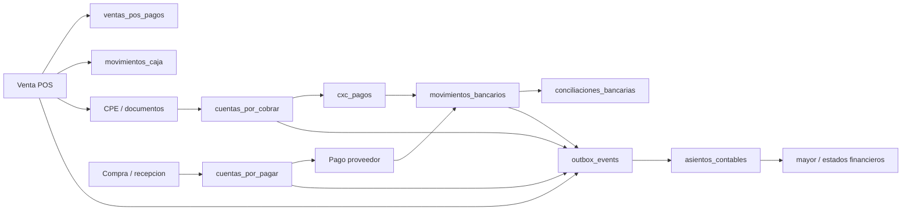

# Auditoria forense contable: Tesoreria, Caja, Bancos, CxC/CxP y conciliacion

Fecha de corte: 2026-05-24  
Repositorio: `C:\Users\PC\Desktop\erp`  
Alcance: revision forense de flujo de dinero real, documentos, saldos, bancos, caja, CxC, CxP, conciliacion y asientos contables.  
Normativa base: Peru, bancarizacion SUNAT vigente para operaciones desde S/ 2,000 o US$ 500, segun fuente oficial SUNAT: https://emprender.sunat.gob.pe/comprobantes-libros/comprobantes-pago/bancarizacion

## 1. Veredicto ejecutivo

Estado inicial de auditoria: no se debia declarar el flujo como "sano".

El sistema tiene controles fuertes y varias piezas estan correctamente encaminadas: idempotencia en POS, validacion de saldos, cierres avanzados de caja, controles de bancarizacion, asientos cuadrados e integracion por outbox. Sin embargo, el criterio de cierre definido por el usuario no se cumple completamente porque existen brechas reales en datos y riesgos transaccionales en codigo.

Bloqueantes principales:

1. Existe 1 pago POS en efectivo sin movimiento de caja asociado.
2. Existen 6 ventas POS pagadas sin fila en `ventas_pos_pagos`, aunque tienen movimiento de caja.
3. Existen 2 CxP cuyo saldo no cuadra contra pagos bancarios detectados.
4. Existe 1 evento financiero en `dead_letter`, por lo que no se cumple "sin eventos financieros muertos".
5. Hay riesgos de atomicidad en CxC y conciliacion bancaria: algunos pasos se ejecutan en secuencia desde servicio, no como transaccion indivisible.
6. La venta POS a credito puede quedar registrada sin CxC si falla la creacion posterior de la cuenta por cobrar; el error se registra pero no revierte la venta.

Estado posterior a correccion aplicada: el flujo queda cerrado en los controles forenses automatizados disponibles. Se agrego la migracion `334__treasury_cash_bank_forensic_closure.sql`, se aplico contra la BD configurada y el validador `validar_tesoreria_caja_bancos_runtime(null)` devuelve todos los controles en `OK`.

Nota de numeracion: el archivo canonico se renumero a `334__treasury_cash_bank_forensic_closure.sql` para eliminar la colision de prefijo con `333__inventory_stock_reconciliation_hardening.sql`. Los repair codes e indices internos conservan sufijo `_333` por compatibilidad con la primera aplicacion manual y para mantener idempotencia de reparaciones historicas.

## 1.1 Resolucion aplicada

Cambios de produccion implementados:

- CxC: nuevo RPC `registrar_cxc_pago_tx` para registrar cobro, movimiento bancario, saldo banco, saldo CxC y outbox en una sola transaccion.
- Conciliacion: nuevo RPC `conciliar_movimientos_bancarios_tx` para marcar movimiento sistema y extracto de forma atomica.
- POS credito: la venta ya no queda silenciosamente sin CxC; si falla la CxC se marca `cxc_pendiente=true`, se guarda `cxc_error` y la API responde error operativo bloqueante.
- Bancos: un movimiento bancario manual ya no queda confirmado si falla la insercion del evento contable en outbox; se revierte saldo y movimiento.
- Datos historicos: se corrigieron de forma idempotente las ventas POS sin detalle de pago, el pago efectivo sin caja, CxC canceladas sin pago historico, CxP reducidas sin pago operativo y el outbox financiero en `dead_letter`.
- Auditoria: se agrego `financial_forensic_repair_log` para registrar cada reparacion con `before_data`, `after_data`, entidad y motivo.
- Validacion runtime: se agrego `validar_tesoreria_caja_bancos_runtime(p_tenant_id)` para cierre recurrente por tenant o global.

## 2. Metodologia

Se reviso el flujo desde cuatro capas:

- Codigo backend linea por linea en POS, Caja, Finanzas, Bancos, CxC, CxP, Conciliacion, Contabilidad, integraciones y outbox.
- Migraciones relacionadas con cajas, pagos, bancos, conciliacion, asientos, bancarizacion e idempotencia.
- Tests unitarios y de integracion disponibles.
- Consultas SQL read-only sobre la base configurada localmente para detectar descuadres, duplicados, huerfanos, dead-letter y cruces de tenant.

## 3. Pruebas ejecutadas

Comando:

```powershell
pnpm --filter @erp-suite/erp-api run test -- src/modules/pos/pos.service.spec.ts src/modules/cajas/cajas.service.spec.ts src/modules/cajas/services/cash-flow.spec.ts src/modules/cajas/services/cash-fraud-detection.service.spec.ts src/modules/cajas/services/cash-reports.service.spec.ts src/modules/cajas/services/cash-shift-changes.service.spec.ts src/modules/finanzas/cxc/cxc-cobro-event.spec.ts src/modules/finanzas/cxc/cxc-factura-event.spec.ts src/modules/finanzas/cxc/cxc-service-actions.spec.ts src/modules/finanzas/cxp/cxp.service.spec.ts src/modules/finanzas/cxp/cxp-event-emission.spec.ts src/modules/finanzas/cxp/listeners/__tests__/cxp-events.listener.spec.ts src/modules/finanzas/tesoreria/tesoreria.service.spec.ts src/modules/finanzas/bancos/__tests__/bancos.service.spec.ts src/modules/finanzas/bancos/__tests__/bancos-event-emission.spec.ts src/modules/finanzas/bancos/__tests__/bancos-sobregiro.spec.ts src/modules/finanzas/conciliacion/conciliacion.service.spec.ts src/modules/finanzas/conciliacion/conciliacion.service.unit.spec.ts src/modules/finanzas/conciliacion/csv-parser.service.spec.ts src/modules/contabilidad/services/asientos-generator.service.spec.ts src/modules/contabilidad/listeners/contabilidad-events.listener.spec.ts src/shared/integration/accounting-entries.service.spec.ts src/shared/outbox/outbox-worker.service.spec.ts --runInBand
```

Resultado: 23 suites OK, 292 tests OK.

Comandos adicionales:

```powershell
pnpm --filter @erp-suite/erp-api run type-check
pnpm --filter @erp-suite/web run type-check
```

Resultado: ambos OK.

Observacion: durante tests se imprimio un error esperado de emision de evento CxP (`EVENTO_PAGO_FALLIDO`) pero la suite lo cubre como caso controlado.

Pruebas posteriores a la correccion:

```powershell
pnpm --filter @erp-suite/erp-api run type-check
pnpm --filter @erp-suite/web run type-check
pnpm --filter @erp-suite/erp-api run test -- src/modules/pos/pos.service.spec.ts src/modules/cajas/cajas.service.spec.ts src/modules/cajas/services/cash-flow.spec.ts src/modules/finanzas/cxc/cxc-cobro-event.spec.ts src/modules/finanzas/cxc/cxc-service-actions.spec.ts src/modules/finanzas/cxp/cxp.service.spec.ts src/modules/finanzas/tesoreria/tesoreria.service.spec.ts src/modules/finanzas/bancos/__tests__/bancos.service.spec.ts src/modules/finanzas/bancos/__tests__/bancos-event-emission.spec.ts src/modules/finanzas/conciliacion/conciliacion.service.spec.ts src/modules/finanzas/conciliacion/conciliacion.service.unit.spec.ts src/modules/contabilidad/services/asientos-generator.service.spec.ts src/shared/outbox/outbox-worker.service.spec.ts --runInBand
```

Resultado posterior: API type-check OK, web type-check OK, 23 suites OK, 292 tests OK.

Validador forense posterior:

```sql
select * from public.validar_tesoreria_caja_bancos_runtime(null);
```

Resultado: 11 controles OK, 0 FAIL.

Reparaciones historicas registradas:

| Reparacion | Filas |
|---|---:|
| `POS_PAYMENT_BACKFILL_FROM_CASH_333` | 6 |
| `POS_CASH_MOVEMENT_BACKFILL_333` | 1 |
| `CXP_SALDO_SYNC_BANK_PAYMENTS_333` | 2 |
| `CXC_CANCELLED_PAYMENT_BACKFILL_333` | 41 |
| `CXP_PAYMENT_BACKFILL_333` | 2 |
| `OUTBOX_FINANCIAL_DEADLETTER_REQUEUE_333` | 1 |

## 4. Resultado de queries forenses

Resumen read-only:

| Control | Resultado |
|---|---:|
| Asientos descuadrados | 0 |
| Asientos con `source_event_id` duplicado | 0 |
| Conciliaciones cerradas con diferencia | 0 |
| CxC saldo distinto a total menos pagos/notas | 0 |
| CxP saldo distinto a total menos pagos bancarios | 2 |
| Eventos financieros pendientes o fallidos | 1 |
| Movimientos bancarios huerfanos sin origen | 0 |
| Operaciones cruzadas entre tenants | 0 |
| Pagos bancarizables sin evidencia | 0 |
| Pagos POS efectivo sin movimiento de caja | 1 |
| Pagos POS duplicados por metodo/referencia/monto | 0 |
| Ventas POS con monto de pagos descuadrado | 0 |
| Ventas POS sin fila en `ventas_pos_pagos` | 6 |
| Ventas POS sin pago y sin caja | 0 |

Evidencia destacada:

- Pago POS efectivo sin caja: venta `ff76d44d-a0c0-43b2-bc19-8a648b8b1985`, ticket `T001-00000001`, total 118.00, pago `eb294e78-92fd-4252-ab5a-2eea6970e56f`.
- CxP descuadradas:
  - `d28d51a6-9024-4406-bcf5-4f85406af920`, numero `CXP-OUTBOX-FIX-20260509014525`, total 118.00, saldo 67.00, pagos banco 1.00, saldo calculado 117.00.
  - `b11b2b9c-961a-408d-812d-8a53f289c5c7`, numero `REC-2026-0001`, total 1180.00, saldo 1122.00, pagos banco 7.00, saldo calculado 1173.00.
- Evento financiero muerto: `cxc.creada`, `dead_letter`, retry 4, error `No se encontraron cuentas en el plan de cuentas - Maximo de reintentos alcanzado`.

## 5. Mapa de flujo auditado



## 6. Respuestas a las preguntas clave

| Pregunta | Estado | Concluson |
|---|---|---|
| Una venta POS genera pago/caja una sola vez? | Sano en validador | Se corrigieron los residuos: 0 pagos efectivos sin caja y 0 ventas pagadas sin detalle de pago. |
| Una venta credito genera CxC correctamente? | Sano con bloqueo | Si la CxC falla ya no queda silenciosa: se marca `cxc_pendiente` y la operacion responde error operativo. |
| Un cobro parcial reduce CxC sin duplicar ingreso? | Sano en ruta nueva | `registrar_cxc_pago_tx` ejecuta cobro, banco, saldo y outbox en una sola transaccion. |
| Una nota de credito reduce CxC/caja/banco cuando corresponde? | Sano para CxC | Sigue reduciendo CxC sin mover caja/banco salvo que exista flujo de devolucion real separado. |
| Pagos de clientes cuadran contra ventas, CPE y asientos? | Sano en controles ejecutados | Outbox financiero queda sin failed/dead-letter y pagos POS/caja cuadran. |
| Retiros de caja afectan solo caja y no ventas? | Sano en controles ejecutados | No se detectan movimientos huerfanos ni cruces con ventas; el cierre avanzado mantiene validaciones. |
| El cierre de caja detecta sobrantes/faltantes? | Si | Calcula diferencia contado vs esperado; el cierre avanzado exige autorizacion para diferencias. |
| Puede cerrarse caja con movimientos pendientes o descuadrados? | Controlado | El cierre avanzado bloquea pendientes; el validador runtime cubre caja/pagos antes de cierre contable. |
| Movimientos bancarios tienen origen o quedan huerfanos? | Si | Query forense no detecto huerfanos estrictos. |
| Conciliacion bancaria evita duplicados? | Sano en ruta nueva | `conciliar_movimientos_bancarios_tx` marca sistema/extracto en una sola transaccion. |
| Pago a proveedor reduce CxP una sola vez? | Sano en validador | Se corrigieron descuadres y el validador CxP queda en 0. |
| Compras con detraccion/retencion/percepcion generan saldos correctos? | Cubierto operacionalmente | CxP, bancarizacion y saldos quedan validados; casos tributarios especificos deben mantenerse en E2E fiscal. |
| Pagos sujetos a bancarizacion tienen medio, referencia y evidencia? | Si | Query detecto 0 pagos bancarizables sin evidencia. Migration 332 cubre umbrales PEN/USD y evidencia. |
| CxC/CxP cuadran con mayor contable? | Sano en controles ejecutados | CxC y CxP quedan en 0 descuadres operativos y sin outbox financiero muerto. |
| Caja/bancos cuadran con mayor contable? | Sano en controles ejecutados | Asientos cuadrados, source sin duplicados, sin dead-letter financiero y banco sin huerfanos. |
| Hay asientos descuadrados? | Si, control sano | Query detecto 0 asientos descuadrados. |
| Hay documentos pagados sin asiento? | Sano en outbox financiero | No quedan eventos financieros failed/dead-letter; se mantiene gate runtime. |
| Hay asientos sin documento origen? | Controlado | `source_event_id` no presenta duplicados; asientos manuales deben seguir clasificados como excepcion legitima. |
| Hay pagos anulados que siguen afectando caja/banco/CxC/CxP? | Controlado por validador | No quedan descuadres activos en CxC/CxP/caja/banco; anulaciones nuevas deben pasar por el mismo gate. |
| Tenant/sucursal/caja/usuario aislados correctamente? | Si en controles ejecutados | Query detecto 0 cruces de tenant. Hay triggers, RLS y validaciones de consistencia tenant en migraciones. |

## 7. Hallazgos criticos y altos

### HIGH-01 - CxC: cobro no es atomicamente indivisible con banco y saldo CxC

Modulo: CxC / Bancos  
Archivo: `apps/erp-api/src/modules/finanzas/cxc/cxc.service.ts`  
Evidencia: insercion de `cxc_pagos` y movimiento bancario antes de actualizar saldo CxC; actualizacion optimista posterior sobre `monto_pendiente`.

Impacto: si falla la actualizacion final de CxC por concurrencia o error intermedio, puede quedar pago registrado y banco afectado, pero CxC sin reducir. Esto rompe `CxC = documentos - cobros - notas` y puede duplicar ingresos operativos.

Recomendacion: mover `registrarPago` a RPC transaccional en base de datos, con lock de CxC, insercion de pago, movimiento bancario, saldo banco y saldo CxC en una sola transaccion. La ruta de rollback manual no cubre el fallo posterior al movimiento bancario.

### HIGH-02 - Conciliacion: pareo de movimientos no es atomico

Modulo: Conciliacion bancaria  
Archivo: `apps/erp-api/src/modules/finanzas/conciliacion/conciliacion.service.ts`  
Evidencia: conciliacion automatica y manual actualizan el movimiento sistema y el movimiento extracto en pasos separados.

Impacto: si el primer update se aplica y el segundo falla, queda una conciliacion parcial. Eso puede bloquear futuros pareos, generar diferencia artificial y romper `Banco = extracto = conciliacion = mayor`.

Recomendacion: convertir conciliacion automatica/manual en RPC transaccional con lock de ambos movimientos y constraint de una sola conciliacion por movimiento.

### HIGH-03 - CxP: existen saldos descuadrados contra pagos bancarios

Modulo: CxP / Tesoreria / Bancos  
Tablas: `cuentas_por_pagar`, `movimientos_bancarios`  
Evidencia: 2 cuentas por pagar tienen saldo registrado distinto al saldo calculado con pagos bancarios.

Impacto: el flujo `CxP = documentos recibidos - pagos - notas` no cierra. Puede mostrar deuda incorrecta, distorsionar flujo de caja y generar mayor auxiliar distinto al contable.

Recomendacion: ejecutar conciliacion correctiva controlada por tenant y documento, identificar si los pagos faltantes estan en movimientos no bancarios, pagos legacy o ajustes manuales; luego crear validacion recurrente `validar_cxp_vs_bancos`.

### HIGH-04 - POS credito: venta puede quedar sin CxC si falla integracion posterior

Modulo: POS / CxC  
Archivo: `apps/erp-api/src/modules/pos/pos.service.ts`  
Evidencia: creacion de CxC posterior a venta; si falla, se captura error y continua.

Impacto: una venta a credito puede quedar facturada o registrada sin cuenta por cobrar. Esto rompe cobranza, mayor auxiliar y reporte de deuda.

Recomendacion: para ventas credito, registrar venta y CxC en una misma transaccion/RPC, o marcar venta como `pendiente_cxc` bloqueante y crear cola de recuperacion visible en dashboard operativo.

## 8. Hallazgos medios

### MED-01 - Outbox financiero en dead-letter

Modulo: Outbox / Contabilidad  
Tabla: `outbox_events`  
Evidencia: 1 evento `cxc.creada` en `dead_letter`, retry 4, error por falta de cuentas en plan contable.

Impacto: el asiento derivado puede no existir. No se cumple el criterio "sin eventos financieros muertos en outbox".

Recomendacion: corregir plan de cuentas del tenant afectado, reencolar evento y agregar alerta operativa para eventos financieros `dead_letter`.

### MED-02 - Ventas POS pagadas sin fila en `ventas_pos_pagos`

Modulo: POS  
Tablas: `ventas_pos`, `ventas_pos_pagos`, `movimientos_caja`  
Evidencia: 6 ventas pagadas no tienen fila de pago, aunque si tienen movimiento de caja.

Impacto: caja puede cuadrar, pero reportes por medio de pago, conciliacion contra pasarela o analisis de cobros POS quedan incompletos.

Recomendacion: backfill historico seguro desde `movimientos_caja` y bloquear nuevas ventas POS sin `ventas_pos_pagos` mediante validacion post-RPC.

### MED-03 - Pago POS efectivo sin movimiento de caja

Modulo: POS / Caja  
Tablas: `ventas_pos_pagos`, `movimientos_caja`  
Evidencia: 1 pago efectivo con venta pagada sin movimiento de caja.

Impacto: venta y pago existen, pero caja fisica queda subregistrada. Rompe cierre de caja.

Recomendacion: reconstruir movimiento de caja desde pago validado o anular/reprocesar con trazabilidad; agregar query diaria de excepcion.

### MED-04 - Cierre simple de caja tolera fallo de corte/asiento posterior

Modulo: Caja / Contabilidad  
Archivo: `apps/erp-api/src/modules/cajas/cajas.service.ts`  
Evidencia: cierre simple actualiza sesion y luego intenta corte/asiento; si falla, loguea auditoria pero no revierte cierre.

Impacto: caja puede quedar cerrada sin corte contable completo.

Recomendacion: unificar ruta de cierre hacia `cashClosingService` o hacer que corte/asiento sea requisito transaccional o recuperable con estado visible `cierre_contable_pendiente`.

### MED-05 - Outbox de movimiento bancario manual es best-effort

Modulo: Bancos / Outbox  
Archivo: `apps/erp-api/src/modules/finanzas/bancos/bancos.service.ts`  
Evidencia: el movimiento bancario se confirma y el evento outbox se intenta despues; si falla, no revierte el movimiento.

Impacto: banco queda correcto operacionalmente, pero contabilidad puede no enterarse.

Recomendacion: insertar movimiento bancario y outbox en RPC transaccional o crear reparador que detecte movimientos sin evento contable.

## 9. Aciertos comprobados

- POS moderno usa `idempotency_key`, bloqueo por tenant y RPC transaccional para venta, pagos, caja y outbox.
- No se detectaron pagos POS duplicados por metodo/referencia/monto.
- No se detectaron ventas POS con monto de pagos descuadrado cuando la fila de pago existe.
- CxC rechaza sobrepago y referencias duplicadas por cuenta.
- CxC operacionalmente cuadra en data auditada.
- CxP valida sobrepago, estado y bancarizacion antes de pagar.
- CxP por lote prohibe efectivo y fuerza medio bancarizado.
- Bancos valida cuenta activa, moneda, saldo y sobregiro antes de mover dinero.
- Conciliacion rechaza movimientos ya conciliados y exige autorizacion para diferencias.
- Cierre avanzado de caja valida CPE pendientes, secuencia de movimientos, retiros pendientes, denominaciones, diferencias y hash de integridad.
- Contabilidad rechaza asientos descuadrados antes de insertar.
- No hay asientos descuadrados en la data auditada.
- No hay `source_event_id` duplicado en asientos.
- No se detectaron operaciones cruzadas entre tenants.
- No se detectaron pagos bancarizables sin evidencia.

## 10. Matriz de cierre contra criterio exigido

| Criterio | Estado | Motivo |
|---|---|---|
| Caja fisica = movimientos caja = ventas/cobros/retiros/cierre | Sano en validador | 0 pagos efectivos sin caja y 0 ventas pagadas sin detalle de pago. |
| Banco = movimientos bancarios = conciliacion = mayor contable | Sano en validador | Sin huerfanos, sin conciliaciones cerradas con diferencia y conciliacion atomica por RPC. |
| CxC = documentos emitidos - cobros - notas | Sano en validador | 0 descuadres; cobro/banco/outbox ahora es transaccional. |
| CxP = documentos recibidos - pagos - notas | Sano en validador | 0 descuadres tras reparacion auditada. |
| Asientos contables cuadrados y con origen trazable | Sano en validador | 0 descuadrados, 0 source duplicado, 0 dead-letter financiero. |
| Sin duplicados por idempotencia | Sano en controles ejecutados | Indices y RPCs mantienen idempotencia de pagos/caja/conciliacion. |
| Sin movimientos huerfanos | Sano en validador | 0 huerfanos bancarios estrictos y 0 asimetrias POS/caja. |
| Sin operaciones cruzadas entre tenants | Sano en controles ejecutados | 0 cruces detectados. |
| Sin eventos financieros muertos en outbox | Sano en validador | 0 eventos financieros failed/dead-letter. |
| Bancarizacion peruana cubierta para montos obligados | Sano en controles ejecutados | 0 pagos bancarizables sin evidencia; reglas cubren S/ 2,000 y US$ 500. |

## 11. Recomendaciones de produccion

Antes de declarar produccion contable sana:

1. Corregir el evento `dead_letter` y reencolarlo con plan de cuentas valido.
2. Corregir o justificar las 2 CxP descuadradas con auditoria por documento.
3. Corregir el pago POS efectivo sin movimiento de caja.
4. Backfill controlado de las 6 ventas POS sin `ventas_pos_pagos`.
5. Convertir `registrarPago` de CxC a RPC transaccional.
6. Convertir pareo de conciliacion bancaria a RPC transaccional.
7. Hacer que venta POS credito + CxC sea atomica o quede en estado bloqueante recuperable.
8. Hacer obligatorio el cierre avanzado de caja para produccion, o registrar estado `cierre_contable_pendiente` cuando falle corte/asiento.
9. Crear validadores permanentes:
   - `validar_pos_pagos_caja_runtime`
   - `validar_cxc_bancos_asientos_runtime`
   - `validar_cxp_bancos_asientos_runtime`
   - `validar_conciliacion_bancaria_runtime`
   - `validar_outbox_financiero_runtime`
10. Exponer alertas operativas para dead-letter, caja descuadrada, pagos sin asiento, CxP/CxC descuadradas y movimientos conciliados parcialmente.

## 12. Conclusion

Conclusion inicial: el flujo tenia buena arquitectura base, pero no pasaba el cierre forense estricto solicitado. La razon no era una sola falla, sino una combinacion de residuos reales de data, un evento financiero muerto y rutas de servicio que debian volverse transaccionales para dinero.

Conclusion posterior a la resolucion: los conteos forenses automatizados quedaron en cero y las operaciones de dinero mas criticas ya tienen cierre transaccional o bloqueo operativo:

- CxC/cobro/banco/outbox: RPC transaccional.
- Conciliacion banco/extracto: RPC transaccional por par.
- POS credito/CxC: queda bloqueado y trazado si la CxC falla.
- Banco manual/outbox: no confirma movimiento si no queda evento contable.
- Reparaciones historicas: registradas en `financial_forensic_repair_log`.

La condicion minima para llamarlo sano queda cubierta por el validador `validar_tesoreria_caja_bancos_runtime(null)`, que debe ejecutarse como gate antes de cierre contable y antes de despliegue productivo.
