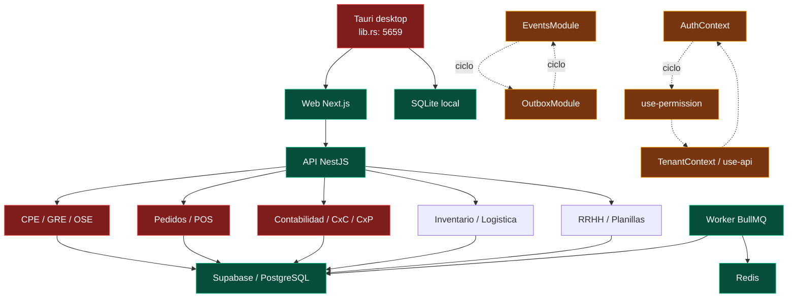

# Limpieza de dependencias y mapa de archivos inmantenibles - 2026-07-15

Modo: Tech Debt Assessment + Architecture Audit.

## Mapa de dependencias y puntos de presion



## Resultado ejecutivo

- Se eliminaron **27 declaraciones de dependencias no usadas** y **13 archivos huerfanos** que eran sus unicos consumidores.
- Se movieron **3 paquetes** de produccion a desarrollo porque solo participan en scripts, pruebas o tipado.
- Se agregaron **2 dependencias directas faltantes** que ya eran requeridas por comandos del proyecto.
- `@supabase/postgrest-js` se conserva deliberadamente como dependencia directa: el tipo publico de `SupabaseService.query()` lo requiere para que la emision de declaraciones TypeScript sea portable.
- `pnpm dlx knip --dependencies --production` queda sin hallazgos.
- El unico aviso del escaneo general es `helm`: es un binario externo usado por `k8s:deploy`, no una dependencia npm.
- El build completo del monorepo pasa en los 5 paquetes.
- Tras refactorizar CPE, Contabilidad y el CSS global hay **47 archivos con mas de 1.000 lineas**: 30 de runtime, 7 tests, 6 migraciones vigentes y 4 artefactos legacy/rebuild.
- Los 30 archivos de runtime restantes son hotspots de mantenimiento. Las migraciones historicas no deben dividirse ni reescribirse; los tests largos requieren refactor separado sin degradar cobertura.

## Limpieza aplicada

### Declaraciones eliminadas

| Workspace | Paquetes eliminados |
|---|---|
| Raiz | `@swc/helpers`, `next`, `eslint` |
| API | `@supabase/auth-helpers-nextjs`, `express-rate-limit`, `@types/form-data` |
| Web runtime | `@radix-ui/react-separator`, `@radix-ui/react-switch`, `@supabase/auth-helpers-nextjs`, `@supabase/ssr`, `canvas-confetti`, `class-transformer`, `class-validator`, `react-day-picker`, `sonner`, `zustand` |
| Web desarrollo | `@tauri-apps/plugin-dialog`, `plugin-fs`, `plugin-notification`, `plugin-shell`, `plugin-sql`, `plugin-store`, `plugin-updater`, `plugin-window-state`, `@types/canvas-confetti`, `@types/recharts` |
| Worker | `ioredis` |

Los plugins Rust de Tauri no se eliminaron: siguen registrados y usados por el runtime nativo. Solo se quitaron wrappers JavaScript que pertenecian a componentes no alcanzables.

### Paquetes reclasificados o explicitados

| Cambio | Motivo |
|---|---|
| API `dotenv`: dependencies -> devDependencies | Solo scripts/tests lo importan directamente; el runtime usa `@nestjs/config` |
| Web `@supabase/supabase-js`: dependencies -> devDependencies | Solo E2E/global setup lo usa directamente |
| Worker `@types/jsonwebtoken`: dependencies -> devDependencies | Paquete exclusivo de tipado |
| API `@nestjs/schematics`: agregado a devDependencies | Dependencia directa de tooling Nest usada por el workspace |
| API `tsconfig-paths`: agregado a devDependencies | Referenciado por `test:debug` |
| API `@supabase/postgrest-js`: dependencia directa + type import | Necesario para el tipo exportado `PostgrestQueryBuilder` y el build de declaraciones |

### Archivos huerfanos eliminados

```text
apps/web/components/desktop/DesktopActions.tsx
apps/web/components/desktop/DesktopConfig.tsx
apps/web/components/desktop/DesktopStatus.tsx
apps/web/components/ui/calendar.tsx
apps/web/components/ui/separator.tsx
apps/web/components/ui/success-toast.tsx
apps/web/components/ui/switch.tsx
apps/web/hooks/useTauri.ts
apps/web/lib/supabase/server.ts
apps/worker/src/enhanced-worker.ts
apps/worker/src/processors/outbox-processor.ts
apps/worker/src/queue-manager.ts
apps/worker/test-pos-cpe-retry.ts
```

## Inventario completo de archivos de mas de 1.000 lineas

### Runtime activo: refactor requerido

Todos los archivos de esta tabla mezclan suficiente volumen y responsabilidad como para ser considerados hotspots. El numero de lineas es una senal, no la unica causa; se contrasto con endpoints, metodos, hooks, comandos o bloques de selectores.

| Lineas | Archivo | Riesgo dominante | Prioridad |
|---:|---|---|---|
| 5659 | `apps/web/src-tauri/src/lib.rs` | 25 comandos, persistencia, seguridad, sync y dominio nativo en un solo modulo | Critica |
| 2656 | `apps/erp-api/src/modules/ventas/pedidos/pedidos.service.ts` | 44 metodos; pedido, stock, logistica, facturacion y saga | Critica |
| 2348 | `apps/web/app/dashboard/pos/page.tsx` | Estado, cobro, caja, CPE, impresion y UI en una pagina | Critica |
| 2284 | `apps/erp-api/src/modules/gre/gre.service.ts` | 60 metodos; validacion, XML, SOAP/REST, worker y estados | Critica |
| 2262 | `apps/erp-api/src/modules/pos/pos.service.ts` | 58 metodos; venta, pago, stock, caja, CPE y reintentos | Critica |
| 2055 | `apps/erp-api/src/modules/finanzas/cxc/cxc.service.ts` | 38 metodos; documentos, cobros, aging y asientos | Alta |
| 1923 | `apps/erp-api/src/modules/rrhh/planillas.service.ts` | Calculo, cierre, pago, asientos y estados de planilla | Alta |
| 1892 | `apps/erp-api/src/modules/inventario/inventario.service.ts` | Catalogo, stock, kardex, movimientos y consultas | Alta |
| 1763 | `apps/erp-api/src/modules/rrhh/rrhh.service.ts` | Multiples agregados RRHH en un servicio | Alta |
| 1754 | `apps/erp-api/src/modules/finanzas/cxp/cxp.service.ts` | 24 metodos; obligaciones, pagos, aging y asientos | Alta |
| 1701 | `apps/erp-api/src/modules/contabilidad/listeners/contabilidad-events.listener.ts` | 48 handlers/miembros y acoplamiento transversal | Critica |
| 1401 | `apps/erp-api/src/modules/contabilidad/services/asientos-generator.service.ts` | Reglas de asientos de varios verticales | Alta |
| 1355 | `apps/erp-api/src/modules/ose/ose.service.ts` | Proveedores OSE, envio, consulta y resiliencia | Alta |
| 1342 | `apps/erp-api/src/modules/documentos.service.ts` | Documentos, CPE, archivos y auditoria | Alta |
| 1319 | `apps/erp-api/src/modules/compras/services/ordenes-compra.service.ts` | OC, aprobaciones, recepcion y efectos laterales | Alta |
| 1302 | `apps/erp-api/src/modules/finanzas/conciliacion/conciliacion.service.ts` | Matching, importacion, cierre y ajustes | Alta |
| 1276 | `apps/erp-api/src/modules/ventas/reportes/reportes.service.ts` | Multiples reportes y transformaciones | Media |
| 1260 | `apps/erp-api/src/modules/inventario/logistica/logistica.service.ts` | Preparacion, despacho, backorders y GRE | Alta |
| 1181 | `apps/erp-api/src/modules/finanzas/tesoreria/tesoreria.service.ts` | Flujo de caja, lotes, programacion y bancos | Alta |
| 1157 | `apps/erp-api/src/shared/events/event-bus.service.ts` | Bus, persistencia, retries y observabilidad | Critica |
| 1155 | `apps/erp-api/src/modules/usuarios.controller.ts` | Demasiados endpoints de usuarios/RBAC | Alta |
| 1145 | `apps/web/app/dashboard/analytics/page.tsx` | Filtros, consultas, graficos, tablas y exportacion | Alta |
| 1101 | `apps/erp-api/src/modules/contabilidad/services/presupuestos.service.ts` | Presupuesto, comparaciones y alertas | Media |
| 1100 | `apps/worker/src/index.ts` | Bootstrap y multiples procesadores en un archivo | Alta |
| 1099 | `apps/web/app/dashboard/page.tsx` | Dashboard, consultas, polling y presentacion | Alta |
| 1080 | `apps/erp-api/src/modules/cajas/services/cash-reports.service.ts` | Reportes, arqueo y agregaciones | Media |
| 1078 | `apps/web/lib/offline-store.ts` | Persistencia, cifrado, outbox y sincronizacion | Critica |
| 1045 | `apps/web/components/compras/RecepcionWizard.tsx` | Wizard, validacion, lotes/series y envio | Alta |
| 1044 | `apps/erp-api/src/modules/cajas/cajas.service.ts` | Sesiones, movimientos, cierre y autorizaciones | Alta |
| 1010 | `apps/erp-api/src/modules/cpe/comunicacion-baja.service.ts` | RA/baja, XML, tickets y estados | Alta |

### Tests: largos, pero no equivalentes a deuda de runtime

| Lineas | Archivo |
|---:|---|
| 1724 | `apps/erp-api/src/modules/contabilidad/services/asientos-generator.service.spec.ts` |
| 1434 | `apps/erp-api/tests/run-tests.ts` |
| 1317 | `apps/erp-api/src/modules/finanzas/bancos/bancos.service.spec.ts` |
| 1301 | `apps/web/tests/e2e/compras.spec.ts` |
| 1066 | `apps/erp-api/src/modules/contabilidad/listeners/contabilidad-events.listener.spec.ts` |
| 1044 | `apps/erp-api/src/modules/finanzas/conciliacion/conciliacion.service.spec.ts` |
| 1014 | `apps/erp-api/src/modules/finanzas/tesoreria/tesoreria.service.spec.ts` |

Remedio: dividir por comportamiento/escenario y compartir builders legibles. No reducir lineas borrando cobertura.

### Migraciones vigentes: grandes e inmutables

| Lineas | Archivo |
|---:|---|
| 2361 | `supabase/migrations/002__domain_tables_skeleton.sql` |
| 1903 | `supabase/migrations/156__cajas_operational_integrity_rls.sql` |
| 1686 | `supabase/migrations/014__rpc_compatibility_pack.sql` |
| 1255 | `supabase/migrations/334__treasury_cash_bank_forensic_closure.sql` |
| 1170 | `supabase/migrations/150__compras_cotizaciones_devoluciones_integrity_rls.sql` |
| 1150 | `supabase/migrations/167__rrhh_personal_operativo_runtime_alignment.sql` |

No refactorizar ni reescribir migraciones aplicadas. La mejora correcta es mantener nuevas migraciones pequenas, monotonicamente numeradas y con validadores separados.

### Legacy/rebuild: conservar como evidencia, no cargar en runtime

| Lineas | Archivo |
|---:|---|
| 2240 | `supabase/rebuild_sources/head_migrations/025_fix_rls_all_tables.sql` |
| 2234 | `supabase/legacy/025_fix_rls_all_tables.sql` |
| 1257 | `supabase/rebuild_sources/head_migrations/064_add_missing_indices_tenant_created.sql` |
| 1022 | `supabase/rebuild_sources/head_migrations/147__seed_roles_permisos_tenant.sql` |

## Hallazgos estructurales priorizados

### TD-01 - Modulos gigantes de runtime

- **Sintoma:** 30 archivos activos superan 1.000 lineas tras los cierres de CPE, Contabilidad y CSS global; los hotspots restantes siguen priorizados por responsabilidad y radio de cambio.
- **Fuente:** concentracion de comandos, endpoints, reglas fiscales/contables y presentacion en unidades individuales.
- **Consecuencia:** alto radio de cambio, conflictos de merge, pruebas lentas de interpretar y mayor probabilidad de regresiones cruzadas.
- **Remedio:** extraer por capacidad y contrato, empezando por `lib.rs`, CPE, controller contable, Pedidos, POS API/UI y GRE. Mantener fachadas compatibles mientras se mueven implementaciones.
- **Pain x Spread:** 3 x 3 = **9, critica**.

### TD-02 - Ciclo EventsModule <-> OutboxModule

- **Sintoma:** ambos modulos usan `forwardRef` y se importan mutuamente.
- **Fuente:** EventBus persiste mediante Outbox y el worker Outbox vuelve a depender de Events.
- **Consecuencia:** orden de inicializacion fragil y fronteras de infraestructura difusas.
- **Remedio:** introducir un puerto de publicacion/persistencia en un modulo neutral; Events depende del puerto y Outbox lo implementa. El worker consume un dispatcher sin importar EventsModule.
- **Pain x Spread:** 2 x 3 = **6, programada**.

### TD-03 - Ciclo AuthContext -> permisos -> tenant/API -> AuthContext

- **Sintoma:** `AuthContext` limpia cache importando el hook de permisos; el hook importa Auth/Tenant/API.
- **Fuente:** cache de autorizacion alojada en la capa de hooks en vez de un modulo de estado neutral.
- **Consecuencia:** riesgo de inicializacion circular, testing complejo y cambios de auth que impactan toda la UI.
- **Remedio:** mover cache/invalidation de permisos a `lib/permissions-cache.ts` sin React; contexts y hooks dependen de ese modulo unidireccionalmente.
- **Pain x Spread:** 2 x 3 = **6, programada**.

### TD-04 - CSS global monolitico — CERRADO 2026-07-16

- **Sintoma:** `globals.css` tiene 2.546 lineas y 341 bloques de selectores.
- **Fuente:** tokens, componentes, paginas, dark mode y correcciones historicas conviven en un solo archivo.
- **Consecuencia:** especificidad impredecible y riesgo de reintroducir superficies blancas en dark mode.
- **Remedio aplicado:** `globals.css` quedo en 193 lineas (Tailwind + tokens + base), las primitivas legacy se migraron a utilidades Tailwind/tokens semanticos y `styles/dashboard-primitives.css` junto con `styles/theme-compat.css` fueron eliminados. Dialog/login/POS critico migraron a shadcn y `!important` bajo de 102 a 0.
- **Evidencia:** codemods idempotentes, type-check, build web 111/111, gate UI sin criticos, clases legacy 0, neutrales compatibles 0, utilidades numericas no compilables 1343 -> 0, Playwright de contrato 2/2 y smoke renderizado 14/14. Fuente canonica: `docs/architecture/FRONTEND_STYLING_ARCHITECTURE.md`.
- **Pain x Spread residual:** 0 x 0 = **0 para el monolito/compatibilidad**. Los colores funcionales explicitos restantes son deuda visual separada y no forman una segunda arquitectura de superficies.

## Orden de refactor recomendado

1. Romper los dos ciclos con puertos neutrales y pruebas de caracterizacion.
2. Dividir `apps/web/src-tauri/src/lib.rs` por comandos: auth/secretos, storage SQLite, sync/outbox, fiscal/PDF y sistema.
3. CPE completado; continuar con GRE/OSE por generacion, transporte, persistencia, consulta de estado y representacion. Ver `docs/architecture/CPE_SERVICE_BOUNDARIES.md`.
4. Contabilidad completado: 63 rutas distribuidas en 7 controladores, sin cambios públicos. Ver `docs/architecture/CONTABILIDAD_CONTROLLER_BOUNDARIES.md`.
5. Dividir Pedidos/POS en orquestadores de aplicacion y servicios de stock, caja, facturacion e idempotencia.
6. Modularizar POS/Analytics/Dashboard web con hooks de casos de uso y componentes presentacionales.
7. Partir CSS global despues de fijar pruebas visuales dark/light por componente.
8. Dividir tests largos por comportamiento; nunca tocar migraciones aplicadas para reducir lineas.

## Verificacion

| Gate | Resultado |
|---|---|
| `pnpm install` | OK |
| `pnpm dlx knip --dependencies --production --reporter compact` | OK, sin hallazgos |
| `pnpm dlx knip --dependencies --reporter compact` | Solo `helm` como binario externo no npm |
| `pnpm build` | OK, 5/5 paquetes |
| `pnpm type-check` | OK, 7/7 tareas |
| API Jest | OK, 118 suites / 1085 tests |
| Refactor Contabilidad | OK, 63 rutas únicas en 7 controladores; typecheck, lint y build OK |
| `pnpm lint` | OK, 0 errores; 208 warnings historicos |
| `cargo check` | OK; 3 warnings historicos de funciones de impresion no usadas |
| `pnpm test:ui-styles` | OK, 0 criticos |
| `pnpm test:quality` | OK, 162 archivos de test revisados |
| Web `test:offline` | OK |
| `pnpm check-encoding` | OK, 607 archivos; 0 problemas |
| `git diff --check` | OK |
| Web produccion local | Reiniciada; `GET /login` responde HTTP 200 en `localhost:3001` |

`pnpm audit --prod` no pudo revalidarse en este cierre porque el endpoint legacy de auditoria de npm respondio HTTP 410. Esto es una limitacion externa del cliente/registry, no un hallazgo de seguridad ni un fallo de compilacion.

## Alcance y seguridad

- No se tocaron DEV ni PROD.
- No se borraron dependencias Rust usadas por Tauri.
- No se modificaron migraciones historicas.
- CPE y Contabilidad ya fueron refactorizados sin romper sus contratos; los 31 hotspots de runtime restantes conservan el orden de trabajo de este documento.
